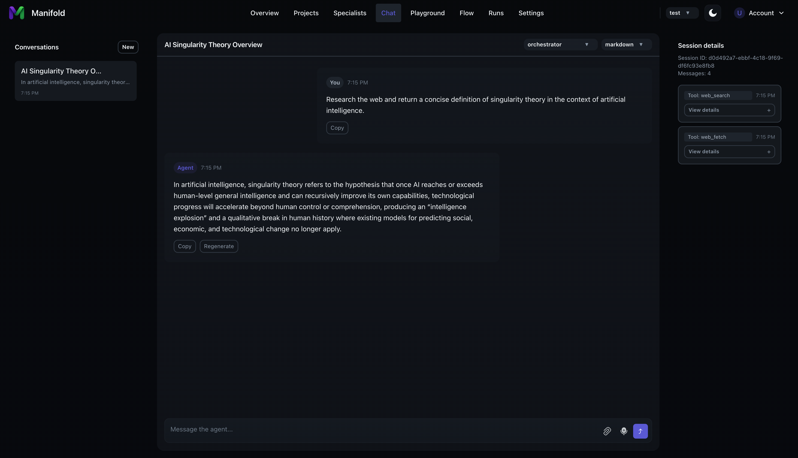
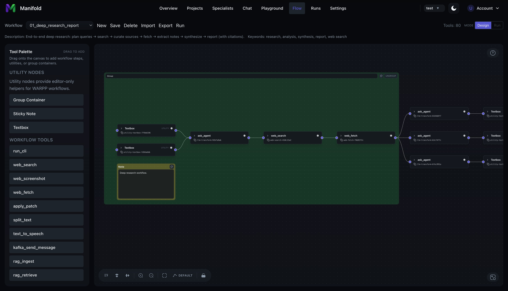

# manifold

Manifold is a platform for enabling workflow automation using AI assistants.

## Features

### **Agent Chat**
Use a traditional chat view to instructs agents to work on objectives.

### **Specialist Registry**
Define and configure AI agents (specialists) and build your team of experts.

### **Projects**
Configure projects as agent workspaces.

### **Integrated tools and MCP Support**
Manifold implements internal tools for agent workflows as well as MCP support to extend the capabilities of your agents.

### **Workflow Editor**
Design agent workflows using a visual flow editor.

### **Prompts, Datasets and Experiments Playground**
Create, iterate and version custom prompts that can be assigned to your agents. Configure datasets and run experiments to understand how prompts affect agent behaviors.

## Quick Start

For step-by-step quick start instructions, see the repository Quick Start guide: [QUICKSTART.md](./QUICKSTART.md)
