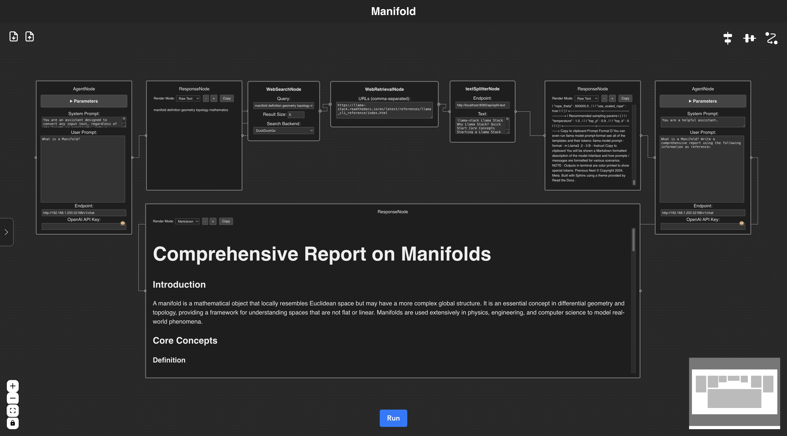
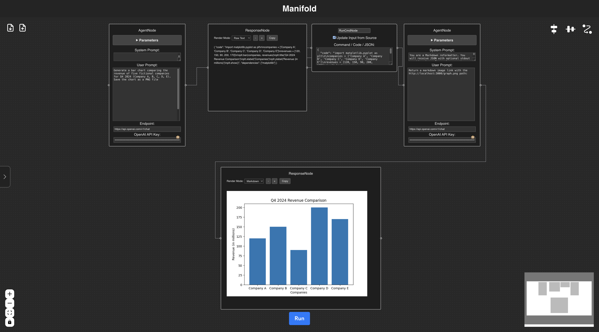
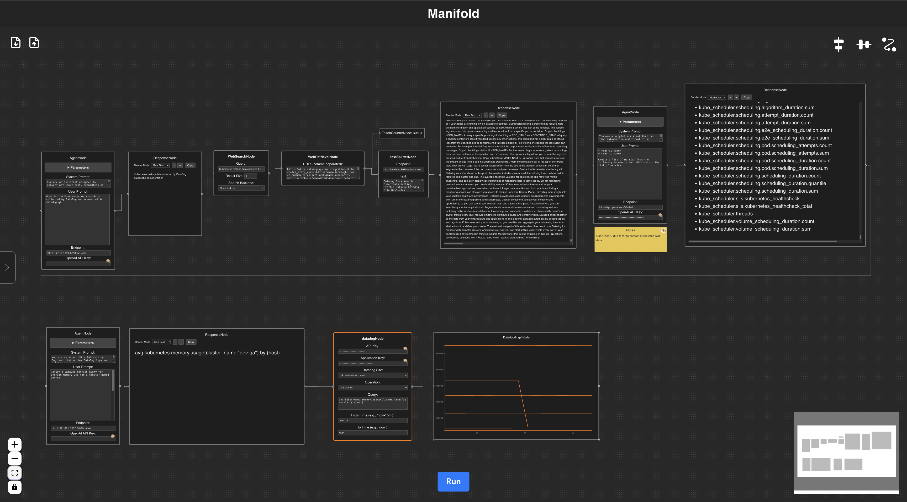

# Manifold


Manifold supports OpenAI compatible endpoints such as [llama-server](https://github.com/ggerganov/llama.cpp/tree/master/examples/server) and [Apple's MLX LM server](https://github.com/ml-explore/mlx-examples/blob/main/llms/mlx_lm/SERVER.md)

Combine public and locally hosted models to create powerful workflows that run sequential or concurrent.

## Web QA



## On Demand Tool/Code Generation and Execution



## DataDog Graph



## Developer Notes

There are various hard coded configurations that need to br broken out into a configuration file the app loads.
For now, developers can change those endpoints and ports via the appropriate component code, or match the hard configuration.

Backend is `localhost:8080` and frontend is `localhost:3000`

We will implement a solution to change the configuration via a `.env` in a future commit.

### External Dependencies

Jaeger is not required, but we recommend [deploying the container](https://www.jaegertracing.io/docs/1.6/getting-started/#all-in-one-docker-image).

[pgvector](https://github.com/pgvector/pgvector) - SQL and vector store

Requires Node 20. We recommend using [NVM](https://github.com/nvm-sh/nvm) to manage Node environments.


Frontend - localhost:3000:
```
$ nvm use 20
$ npm install
$ npm run dev
```

Backend - localhost:8080:

The backend has Open Telemetry support and requires the JAEGER_ENDPOINT (Jaeger) endpoint be set. This does not have to exist so a fake endpoint can be set.
The application will just throw an error when attempting to send telemtry to the endpoint but will still function.

```
$ export JAEGER_ENDPOINT=<my otel endpoint>
$ go mod tidy
$ go run .
```