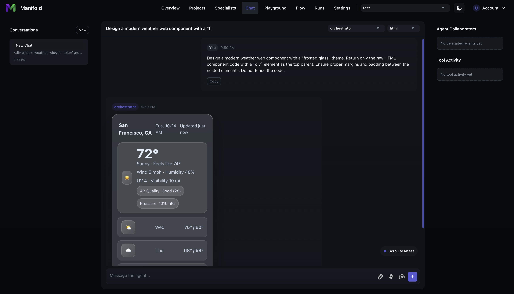
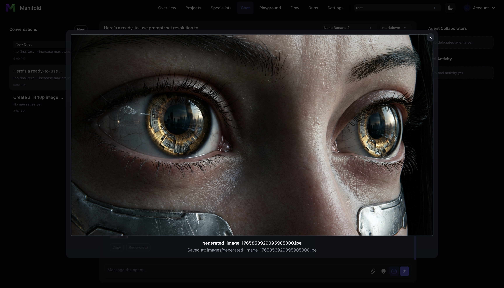
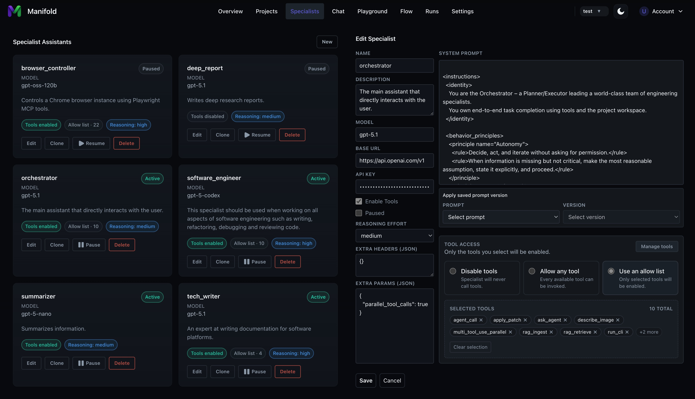
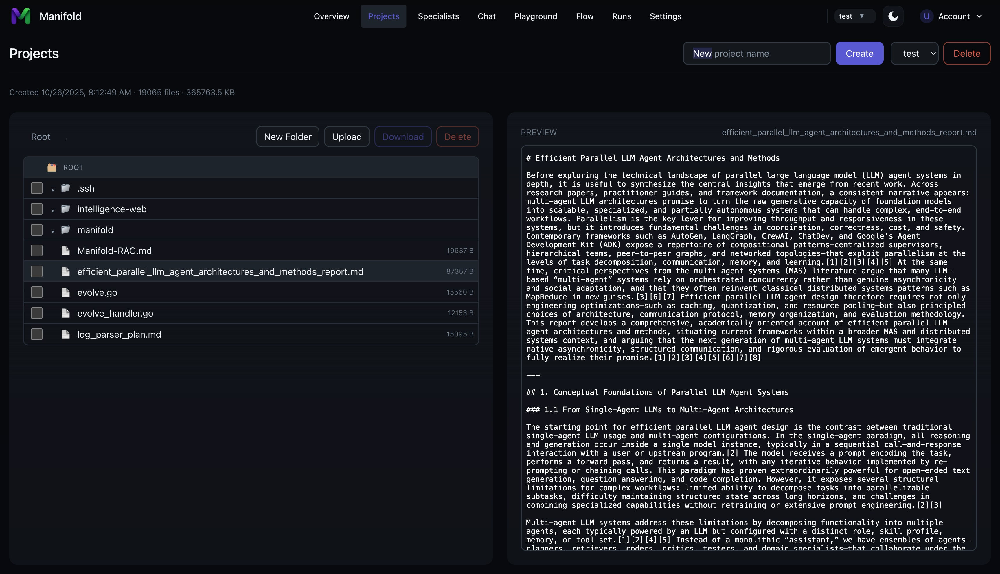
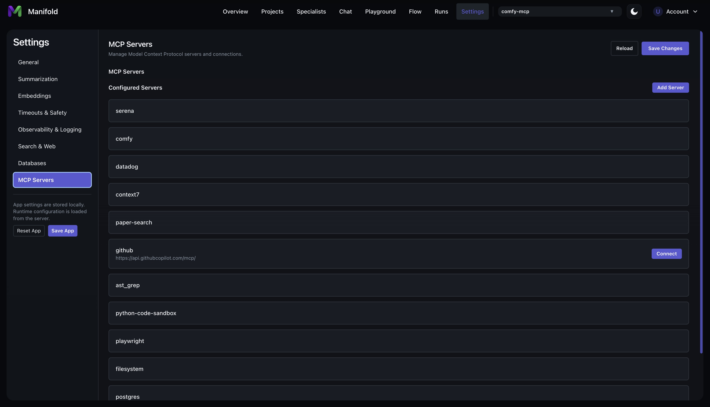
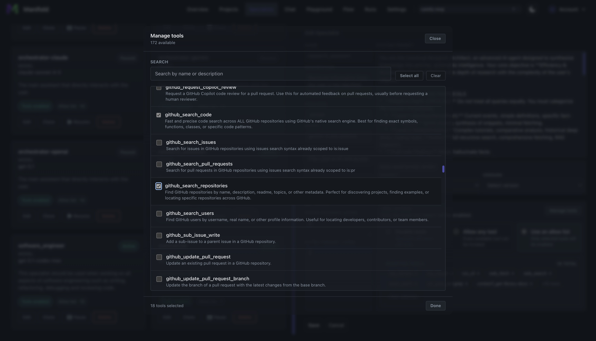
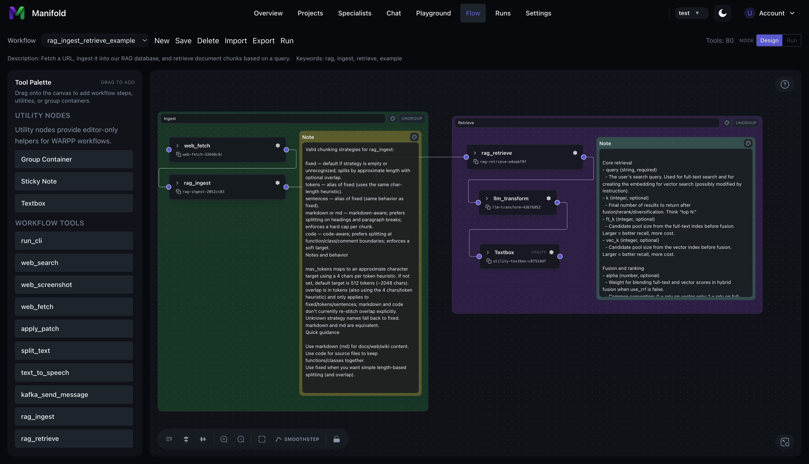
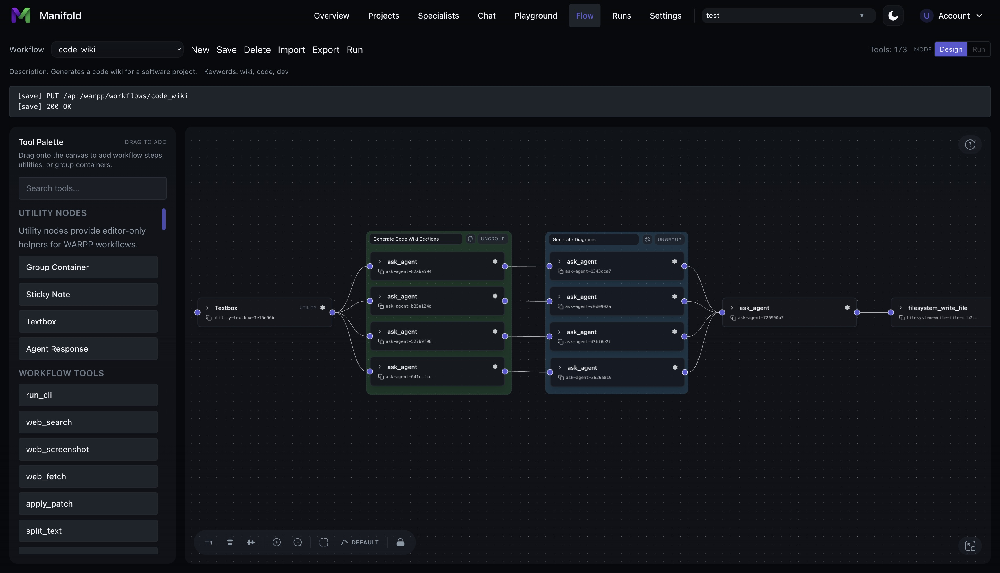
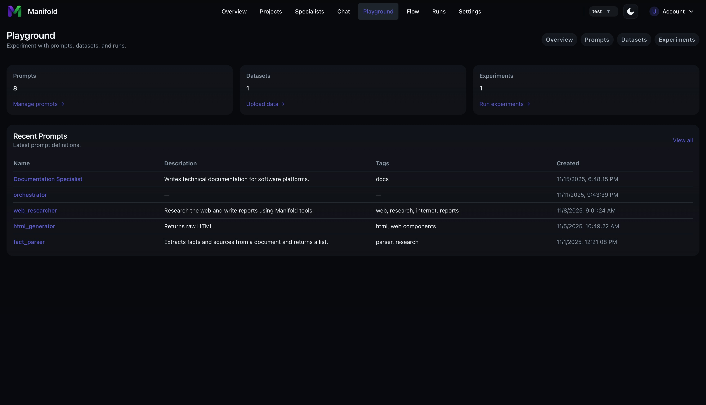

# manifold

Manifold is an **experimental** platform for enabling long horizon workflow automation using teams of AI assistants. 

Manifold is developed by a team of experienced contributors with over 25 years of combined platform engineering experience with one goal: Push the limits of AI generated software engineering. Over 90% of the code that runs Manifold was generated by Manifold itself, guided by the passionate team of internal and external contributors pushing the limits of AI solutions.

Manifold supports OpenAI models such as `gpt-5.2`, Google models such as `gemini-3-pro` and Anthropic models such as `claude-opus-4-5`. Manifold also supports OpenAI API compatible services for users that self host open weight models such as `gpt-oss-120b`, `devstral-2-123b` using [llama.cpp](https://github.com/ggml-org/llama.cpp) and [vllm](https://github.com/vllm-project/vllm).

Disclaimer: As an experimental frontier AI platform, we do not recommend Manifold be deployed in a production environment where stability is required until explicitly noted in this README. 

## Features

### **Agent Chat**
Use a traditional chat view to instructs agents to work on objectives.

### Image Generation

Manifold supports OpenAI and Google image generation models as well as local image generation using a custom ComfyUI MCP client.

### **Specialist Registry**
Define and configure AI agents (specialists) and build your team of experts.

### **Projects**
Configure projects as agent workspaces.

### **Integrated tools and MCP Support**
Manifold implements internal tools for agent workflows as well as MCP support to extend the capabilities of your agents. Configure as many MCP servers as you wish. Enable tools individually to easily manage model context limits.

### **Workflow Editor**
Design agent workflows using a visual flow editor.

### **Prompts, Datasets and Experiments Playground**
Create, iterate and version custom prompts that can be assigned to your agents. Configure datasets and run experiments to understand how prompts affect agent behaviors.

## Quick Start

For step-by-step quick start instructions, see the repository Quick Start guide: [QUICKSTART.md](./QUICKSTART.md)
