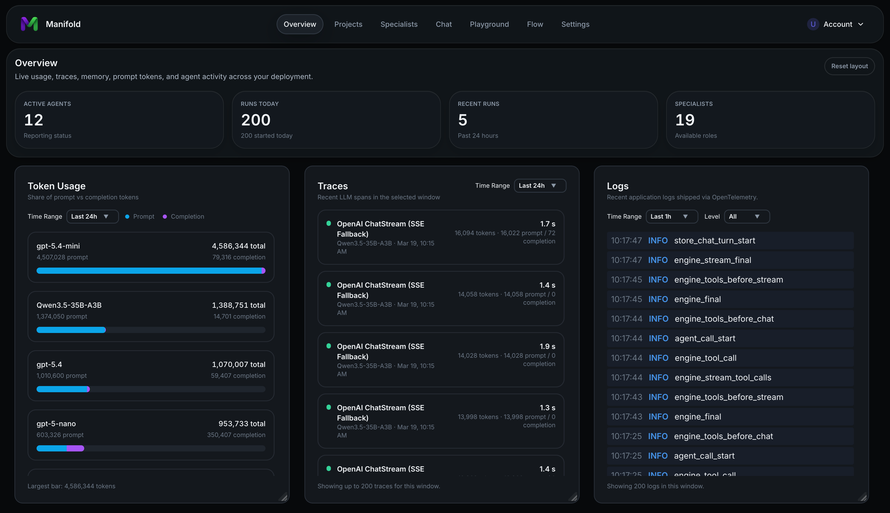
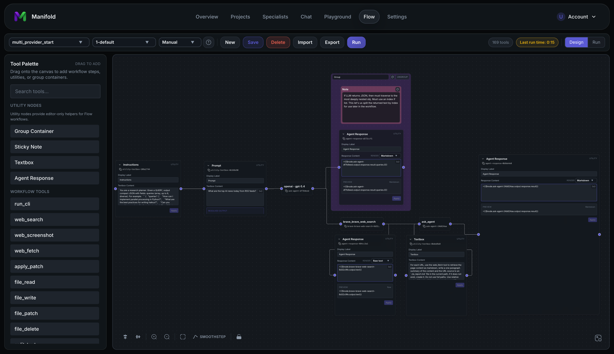

# Manifold

Manifold is an **experimental** platform for long-horizon workflow automation with teams of AI assistants.

It supports OpenAI, Google, and Anthropic models, along with OpenAI-compatible APIs for self-hosted open-weight models served through [llama.cpp](https://github.com/ggml-org/llama.cpp) or [vLLM](https://github.com/vllm-project/vllm).

> [!WARNING]
> Manifold is an experimental frontier AI platform. Do not deploy it in production environments that require strong stability guarantees unless this README explicitly states otherwise.

## What Manifold does

Manifold is built for workflows that go beyond one-shot prompts. It gives you a workspace where specialists, tools, projects, and workflows can work together on multi-step objectives over extended periods.

## Features

### Agent chat

Use a traditional chat interface to assign objectives to specialists.


_Specialists can collaborate across multiple turns. Manifold is designed to take advantage of the long-horizon capabilities of frontier models and can work on complex objectives for hours._

### Observability (work in progress)



### Workflow editor

Design agent workflows with a visual flow editor. __MCP tools are exposed as nodes automagically. Saved workflows become tools that can be invoked by specialists or inserted as nodes into other workflows.__ It's workflows all the way down.




### Image generation

Manifold supports image generation with OpenAI and Google models, as well as local image generation through a custom ComfyUI MCP client.


_Example ComfyUI-generated image using a custom workflow._

### Specialist registry

Define and configure AI agents, then build your own team of experts.


### Projects

Configure projects as agent workspaces.


### Integrated tools and MCP support

Manifold includes built-in tools for agent workflows and supports MCP to extend agent capabilities. You can configure multiple MCP servers and enable tools individually to manage context size more precisely.


### Prompts, datasets, and experiments playground

Create, iterate on, and version prompts that can be assigned to agents. Configure datasets and run experiments to understand how prompt changes affect agent behavior.


## Deploy a fresh clone

The recommended first-run path is Docker-based and does **not** require a local Go, Node, or `pnpm` toolchain.

### Prerequisites

For a basic local deployment, you need:

- Docker with Docker Compose support
- An LLM API key or a reachable OpenAI-compatible endpoint
- A writable host directory to use as `WORKDIR`

Optional local tooling is only needed if you are developing Manifold itself:

- Node 22 and `pnpm` for running the frontend outside Docker
- Go 1.25 for local binary builds
- Chrome or another Chromium-compatible browser if you plan to use browser-driven tools from a host build

### Fast path

```bash
cp example.env .env
cp config.yaml.example config.yaml

# Edit .env and set at minimum:
#   OPENAI_API_KEY=...
#   WORKDIR=/absolute/path/to/your/manifold-workdir

docker compose up -d pg-manifold manifold
```

Then open <http://localhost:32180>.

For the full deployment walkthrough, see:

- [QUICKSTART.md](./QUICKSTART.md)
- [docs/deployment.md](./docs/deployment.md)
