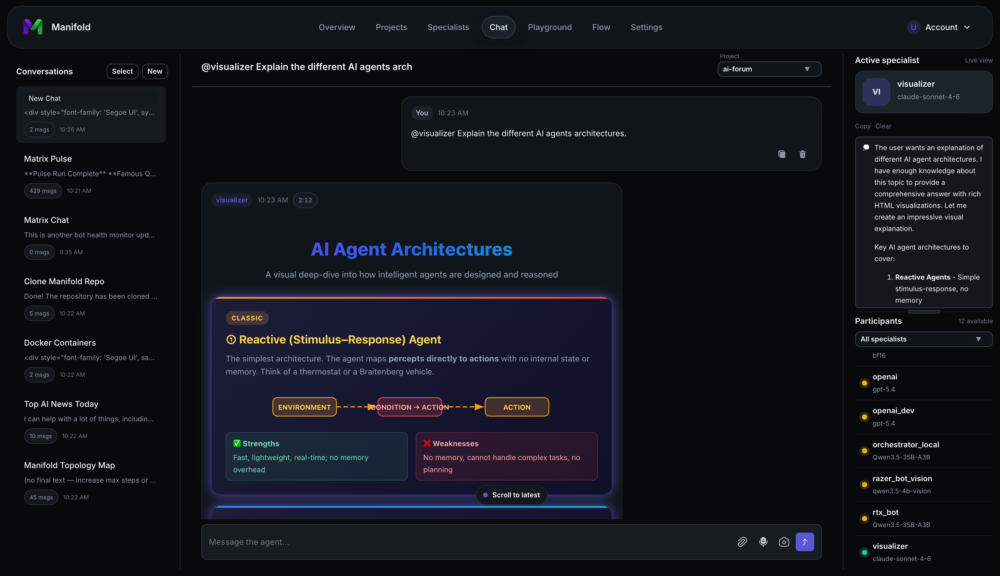
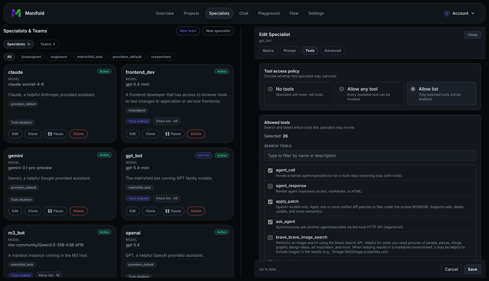
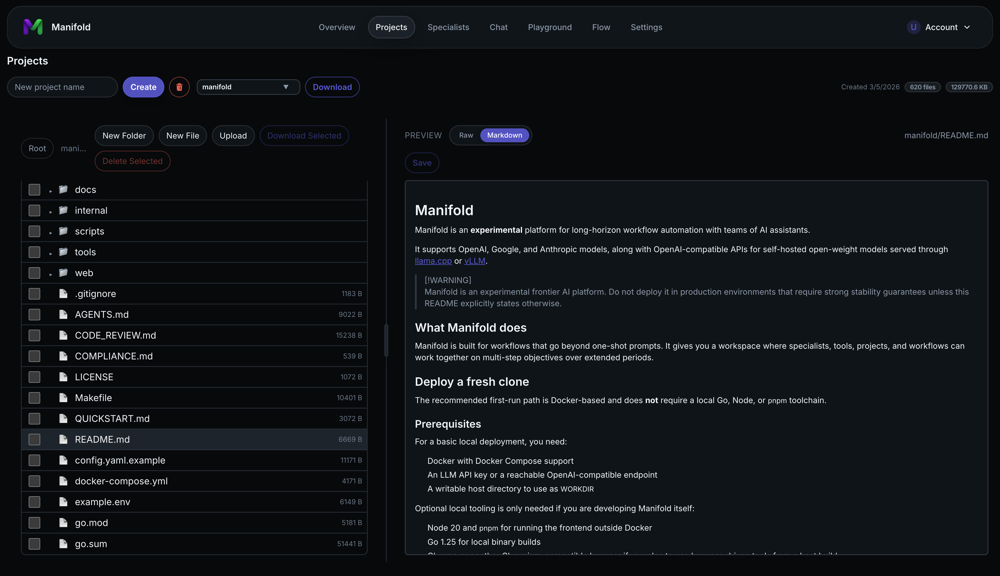
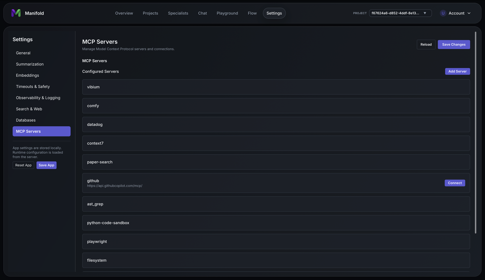
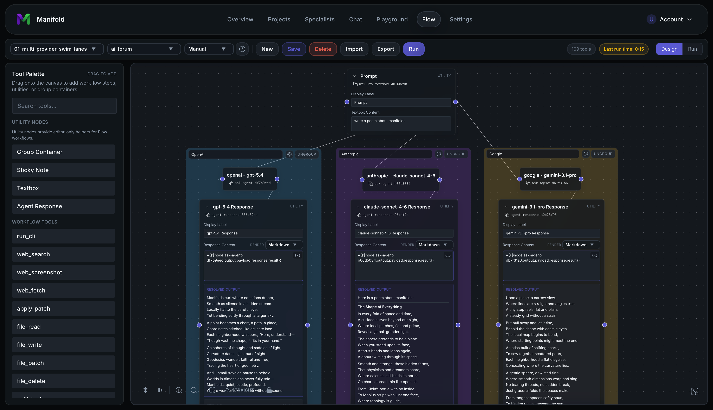
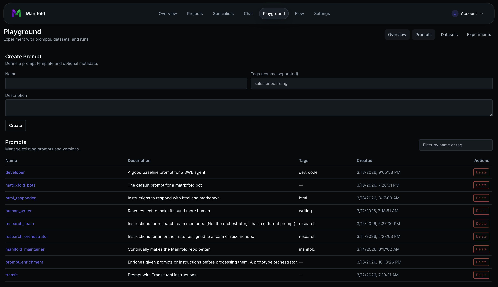

# Manifold

Manifold is an **experimental** platform for long-horizon workflow automation with teams of AI assistants.

It supports OpenAI, Google, and Anthropic models, along with OpenAI-compatible APIs for self-hosted open-weight models served through [llama.cpp](https://github.com/ggml-org/llama.cpp) or [vLLM](https://github.com/vllm-project/vllm).

> [!WARNING]
> Manifold is an experimental frontier AI platform. Do not deploy it in production environments that require strong stability guarantees unless this README explicitly states otherwise.

## What Manifold does

Manifold is built for workflows that go beyond one-shot prompts. It gives you a workspace where specialists, tools, projects, and workflows can work together on multi-step objectives over extended periods.

## Deploy a fresh clone

The recommended first-run path is Docker-based and does **not** require a local Go, Node, or `pnpm` toolchain.

### Prerequisites

For a basic local deployment, you need:

- Docker with Docker Compose support
- An LLM API key or a reachable OpenAI-compatible endpoint
- A writable host directory to use as `WORKDIR`

Optional local tooling is only needed if you are developing Manifold itself:

- Node 20 and `pnpm` for running the frontend outside Docker
- Go 1.25 for local binary builds
- Chrome or another Chromium-compatible browser if you plan to use browser-driven tools from a host build

### Fast path

```bash
cp example.env .env
cp config.yaml.example config.yaml

# Edit .env and set at minimum:
#   OPENAI_API_KEY=...
#   WORKDIR=/absolute/path/to/your/manifold-workdir

docker compose up -d pg-manifold manifold
```

Then open <http://localhost:32180>.

For the full deployment walkthrough, see:

- [QUICKSTART.md](./QUICKSTART.md)
- [docs/deployment.md](./docs/deployment.md)

## Features

### Agent chat

Use a traditional chat interface to assign objectives to specialists.



_Specialists can collaborate across multiple turns. Manifold is designed to take advantage of the long-horizon capabilities of frontier models and can work on complex objectives for hours._

### Image generation

Manifold supports image generation with OpenAI and Google models, as well as local image generation through a custom ComfyUI MCP client.


_Example ComfyUI-generated image using a custom workflow._

### Specialist registry

Define and configure AI agents, then build your own team of experts.



### Projects

Configure projects as agent workspaces.



### Integrated tools and MCP support

Manifold includes built-in tools for agent workflows and supports MCP to extend agent capabilities. You can configure multiple MCP servers and enable tools individually to manage context size more precisely.



### Workflow editor

Design agent workflows with a visual flow editor.



### Prompts, datasets, and experiments playground

Create, iterate on, and version prompts that can be assigned to agents. Configure datasets and run experiments to understand how prompt changes affect agent behavior.



## Quick start

For step-by-step setup instructions, see [QUICKSTART.md](./QUICKSTART.md).

For deployment details, authentication, storage behavior, observability, and troubleshooting, see:

- [docs/deployment.md](./docs/deployment.md)
- [docs/auth.md](./docs/auth.md)
- [docs/storage.md](./docs/storage.md)
- [docs/observability.md](./docs/observability.md)
- [docs/mcp.md](./docs/mcp.md)
- [docs/transit.md](./docs/transit.md)

## API docs

OpenAPI generation and API documentation publishing are documented in [docs/openapi.md](./docs/openapi.md).

## Matrix bot CLI (`manibot`)

Manifold includes a Matrix bot CLI, `manibot`, that forwards room messages to the Manifold backend (`/api/prompt`). This allows responses to use your configured specialists, internal tools, MCP servers, and project skills.

Detailed setup instructions, a `.env` template, and a minimal Docker Compose service example are available in [cmd/manibot/README.md](./cmd/manibot/README.md).

### Run locally

```bash
go run ./cmd/manibot
```

### Required environment variables

- `MATRIX_HOMESERVER_URL`
- `MATRIX_BOT_USER_ID`
- `MATRIX_ACCESS_TOKEN`

### Optional environment variables

- `BOT_PREFIX` — default: `!bot`
- `MANIFOLD_BASE_URL` — default: `http://localhost:32180`
- `MANIFOLD_PROMPT_PATH` — default: `/api/prompt`
- `MANIFOLD_PROJECT_ID` — bind all prompts to a single project/workspace
- `MANIFOLD_SESSION_PREFIX` — default: `matrix`
- `MANIFOLD_REQUEST_TIMEOUT_SECONDS` — default: `180`
- `MATRIX_SYNC_TIMEOUT_SECONDS` — default: `30`
- `MATRIX_SYNC_RETRY_DELAY_SECONDS` — default: `3`
- `MATRIX_PULSE_ENABLED` — default: `false`; enables the background pulse loop
- `MATRIX_PULSE_POLL_INTERVAL_SECONDS` — default: `300`; how often the bot checks room task lists
- `MATRIX_PULSE_LEASE_SECONDS` — default: `MANIFOLD_REQUEST_TIMEOUT_SECONDS + 60`; claim window to prevent duplicate pulse runs
- `PULSE_DATABASE_DSN` — required when pulse is enabled unless one of `DATABASE_URL`, `DB_URL`, or `POSTGRES_DSN` is already set
- `MANIFOLD_SESSION_COOKIE` and `MANIFOLD_SESSION_COOKIE_NAME` — for auth-enabled `agentd` cookie auth
- `MANIFOLD_AUTH_BEARER_TOKEN` — optional bearer token passthrough

### Matrix Pulse automation

`manibot` can run a background pulse loop that checks room-scoped recurring tasks and submits due work to the Manifold orchestrator as automated prompts.

#### Operator model

- Pulse is room-scoped: each Matrix room has its own task list.
- Pulse runs use a separate session from normal room chat, so automated context does not pollute human chat history.
- Due-task state is persisted in the shared database and claimed with a lease so multiple bot instances do not run the same room pulse simultaneously.
- Agents can manage tasks through the `pulse_tasks` tool during both manual chat runs and automated pulse runs.

#### Recommended setup

- Enable pulse only when `manibot` can reach the same Postgres database used by Manifold persistence.
- Set `PULSE_DATABASE_DSN` explicitly if the bot process does not already inherit `DATABASE_URL`.
- Keep `MATRIX_PULSE_POLL_INTERVAL_SECONDS` shorter than the longest task cadence you care about. Per-task intervals are enforced independently of the poll interval.

The `pulse_tasks` tool currently supports:

- `list`
- `configure_room`
- `upsert_task`
- `delete_task`
- `enable_task`
- `disable_task`
- `set_interval`
