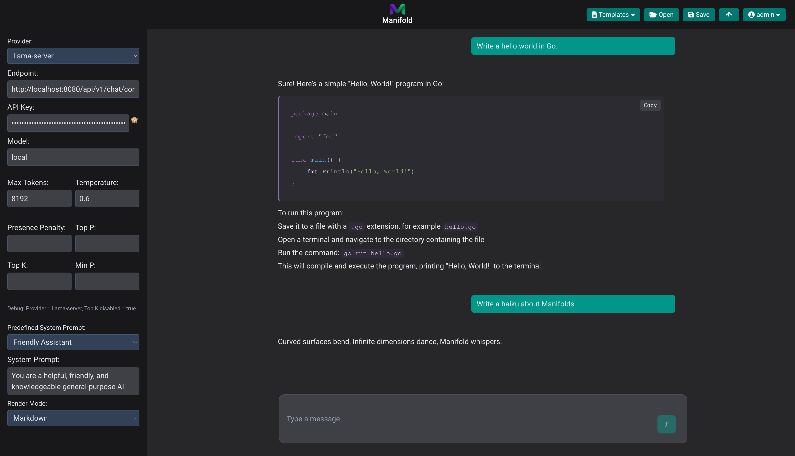
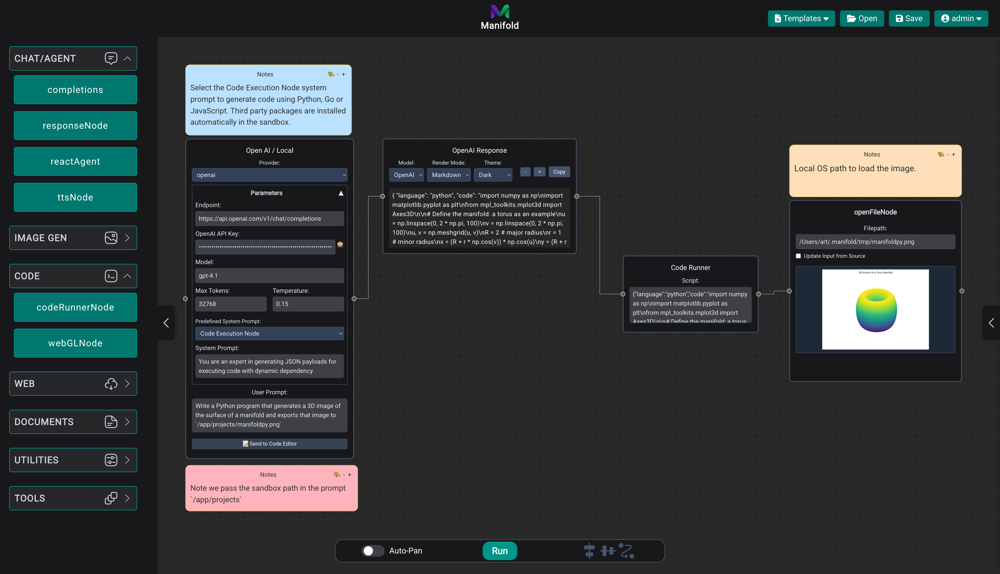

<div align="center">

# Manifold

</div>


*Flow View*

Manifold is a powerful platform designed for workflow automation using AI models. It supports text generation, image generation, and retrieval-augmented generation, integrating seamlessly with popular AI endpoints including OpenAI, llama.cpp, Apple's MLX LM, Google Gemini, Anthropic Claude, ComfyUI, and MFlux. Additionally, Manifold provides robust semantic search capabilities using PGVector combined with the SEFII (Semantic Embedding Forest with Inverted Index) engine.

> **Note:** Manifold is under active development. The platform is not intended for production use until otherwise noted.


*Chat View*

---

## OpenAI, Anthropic, Google and Open Weights Models (llama.cpp or mlx_lm.server backends)

Run parallel inference across multiple providers.


## Powerful ReAct Agent with access to Model Context Protocol servers

Manifold implements an MCP client and a ReAct Agent for full "autopilot" task execution. MCP servers can be configured as Docker containers that mount the same local:container paths for secure tool execution.


Or use the MCP node to list and execute tools as part of your workflows.


## Image Generation and Vision Support

### Image Generation

Manifold supports image generation via ComfyUI in Windows, Linux and MacOS. Manifold also supports MLXFlux image generation on MacOS only, no external service required.


### Vision Support

For now, Manifold supports OpenAI and supported local vision models via `llama.cpp` such as Gemma-3.


## Web Search and Retrieval


## Powerful Document Ingestion and Retrieval

Manifold features a powerful semantic and keyword document ingestion and retrieval engine. Ingest files, entire folders, and even LLM output. Retrieve relevant information for your AI assistant to use as reference.


## Code Execution - Python, Go, JavaScript

### Web Code Editor (WASM Sandbox)


### Code Execution Node (Docker Sandbox w/ 3rd Party Lib Support)



### Prototype Shaders with the WebGL Node


## Controlled Execution Flow

Manifold provides nodes to control the execution order of your workflows.

Run concurrent agents. Jump to nodes. Execute for each loops on assistant outputs. Combine context. Publish and subscribe to topics to teleport context around your workflows. Be creative!


## Prerequisites

Ensure the following software is installed before proceeding:

- **Chrome Browser:** Required for web tools. Used as a headless browser and managed by Manifold. WebGPU support should be enabled for text-to-speech to work.
- **Python:** Version 3.10 or newer ([Download](https://www.python.org/downloads/)).
- **Docker:** Recommended for easy setup of PGVector ([Download](https://www.docker.com/get-started)).

For development, you'll also need:
- **Go:** Version 1.21 or newer ([Download](https://golang.org/dl/)).
- **Node.js:** Version 20 managed via `nvm` ([Installation Guide](https://github.com/nvm-sh/nvm)).

---

## Quick Start with Pre-built Binaries

The easiest way to get started with Manifold is to download a pre-built binary from the [releases page](https://github.com/intelligencedev/manifold/releases).

1. Download the appropriate binary for your platform:
   - macOS: `manifold-darwin-universal.zip` (Universal binary for both Intel and Apple Silicon)
   - Linux: `manifold-linux-amd64.zip` or `manifold-linux-arm64.zip`
   
2. Extract the zip file and navigate to the extracted directory.

3. Create a `config.yaml` file in the same directory as the binary (a template `config.yaml.example` is included).

4. Run the binary:
   ```bash
   # On macOS/Linux
   $ chmod +x manifold-*
   $ ./manifold-*
   ```

---

## Installation from Source

### 1. Clone the Repository

```bash
$ git clone https://github.com/intelligencedev/manifold.git
$ cd manifold
```

### 2. Initialize Submodules

After cloning the repository, initialize and update the git submodules:

```bash
$ git submodule update --init --recursive
```

This will fetch the required dependencies:
- llama.cpp for local model inference
- pgvector for vector similarity search in PostgreSQL

#### PGVector Setup

Manifold will automatically manage the lifecycle of the PGVector container using Docker. Ensure Docker is installed and running on your system.

---

### 3. Install an Image Generation Backend (Choose One)

#### Option A: ComfyUI (Cross-platform)

- Follow the [official ComfyUI installation guide](https://github.com/comfyanonymous/ComfyUI#manual-install-windows-linux).
- No extra configuration needed; Manifold connects via proxy.

#### Option B: MFlux (M-series Macs Only)

- Follow the [MFlux installation guide](https://github.com/filipstrand/mflux).

---

### 4. Configuration

Use the provided `config.yaml.example` template to create a new `config.yaml` file. This file must be placed in the same path as the main.go file if running in development mode, or in the same path as the manifold binary if you build the project.

Ensure to update the values to match your environment.

### 5. Build and Run Manifold

For development it is not necessary to build the application. See development notes at the bottom of this guide.

#### Production Build

Execute the following commands:

```bash
$ cd frontend
$ nvm use 20
$ npm install
$ npm run build
$ cd ..
$ go build -ldflags="-s -w" -trimpath -o ./dist/manifold .

# 1. Copy config.yaml to the dist directory (optional)
$ cp config.yaml ./dist/

# 2. Run the binary (multiple options available)
$ ./dist/manifold                           # Run from project root
# $ cd dist && ./manifold                   # Run from dist directory
# $ ./dist/manifold -config=config.yaml    # Specify config path explicitly
```

#### Development Mode

For development, you can run directly without building:

```bash
$ cd frontend
$ nvm use 20
$ npm install
$ npm run build
$ cd ..

# Run from project root where config.yaml is located
$ go run . -config=config.yaml
```

This sequence will:

- Switch Node.js to version 20.
- Build frontend assets.
- Compile the Go backend, generating the executable.
- Copy the configuration file to the dist directory (for production deployment).
- Launch Manifold with the configuration file.

Upon first execution, Manifold creates necessary directories and files (e.g., `data`).

Note that Manifold builds the frontend and embeds it in its binary. When building the application, the frontend is not a separate web server.

- On first boot, the application will take longer as it downloads the required models for completions, embeddings, and reranker services.
- The application defaults to a single node instance configuration, managing the lifecycle of services using the llama-server backend and bootstrapping PGVector.
- Services can be configured to run on remote hosts to alleviate load on a single host, but users must manage the lifecycle of remote services manually.

---

### 6. Configuration (`config.yaml`)

Create or update your configuration based on the provided `config.yaml.example` in the repository. Manifold uses a flexible configuration system that supports both YAML files and environment variables.

**Important**: The `config.yaml` file location depends on how you run Manifold:
- **Recommended**: Keep `config.yaml` in the project root and run `./dist/manifold` from there
- **Alternative**: Copy `config.yaml` to the dist directory and run from there (`cd dist && ./manifold`)
- **Flexible**: Use the `-config` flag to specify any path: `./dist/manifold -config=/path/to/config.yaml`

**Note**: Manifold embeds all necessary files for MCP server Docker image building, so it will work correctly regardless of which directory you run it from.

**Crucial Points:**

- Update database credentials (`myuser`, `changeme`) according to your PGVector setup.
- When `single_node_instance` is enabled, Manifold auto-manages the lifecycle of llama-server instances.
- When using external API services (OpenAI, Claude, etc.), provide the corresponding API keys.

---

## Supported Endpoints

Manifold is compatible with OpenAI-compatible endpoints:

- [llama.cpp Server](https://github.com/ggerganov/llama.cpp/tree/master/examples/server)
- [Apple MLX LM Server](https://github.com/ml-explore/mlx-examples/blob/main/llms/mlx_lm/SERVER.md)

Any inference engine that serves the standard completions endpoints will work such as vLLM, etc.
---

## Docker Images

### Building the Manifold MCP Docker Image

Manifold provides a Docker image for the Model Context Protocol (MCP) server component, allowing you to run the MCP server in containerized environments.

**Automatic Building**: Manifold automatically builds the MCP Docker image when needed during startup. All required files (Dockerfile, source code, dependencies) are embedded in the Manifold binary, so no manual building is required.

If you want to manually build the Docker image:

```bash
# Navigate to the manifold root directory
$ cd manifold

# Build the Docker image with the intelligencedev/manifold-mcp:latest tag
$ docker build -t intelligencedev/manifold-mcp:latest -f mcpserver.Dockerfile .
```

Once built, you can configure the MCP server in your `config.yaml`:

```yaml
mcpServers:
  manifold:
    command: docker
    args:
      - run
      - --rm
      - -e
      - DATA_PATH=/app/projects
      - -i
      - --volume
      - /Users/$USER/.manifold/tmp:/app/projects
      - --volume
      - /Users/$USER/.ssh:/home/manifold/.ssh:ro
      - -e
      - GIT_SSH_COMMAND="ssh -o StrictHostKeyChecking=no -i /home/manifold/.ssh/id_rsa"
      - intelligencedev/manifold-mcp
    agent_name: manifold_tools
    instructions: |
      You are the tool agent for the "manifold" MCP server.
      Answer questions and execute tools available on this server only.
```

### Tool Agents from `mcpServers`

When one or more `mcpServers` are configured, Manifold queries each server at startup and creates a dedicated *tool agent* for it. Each entry may specify an `agent_name` and custom `instructions` that become the system prompt for that agent. These tool agents expose only the tools from their server and can be consulted via `ask_assistant_worker`. When tool agents exist, individual MCP tools are hidden from the main agent's prompt.

---

## Troubleshooting Common Issues

- **Port Conflict:** If port 8080 is occupied, either terminate conflicting processes or choose a new port in `config.yaml`.
- **PGVector Connectivity:** Confirm your `database.connection_string` matches PGVector container credentials.
- **Missing Config File:** Ensure `config.yaml` exists in the correct directory. Manifold will not launch without it.
- **Docker Issues:** Ensure Docker is installed and running. Manifold embeds all necessary files for building Docker images automatically.

---

## Contributing

Manifold welcomes contributions! Check the open issues for tasks and feel free to submit pull requests.
