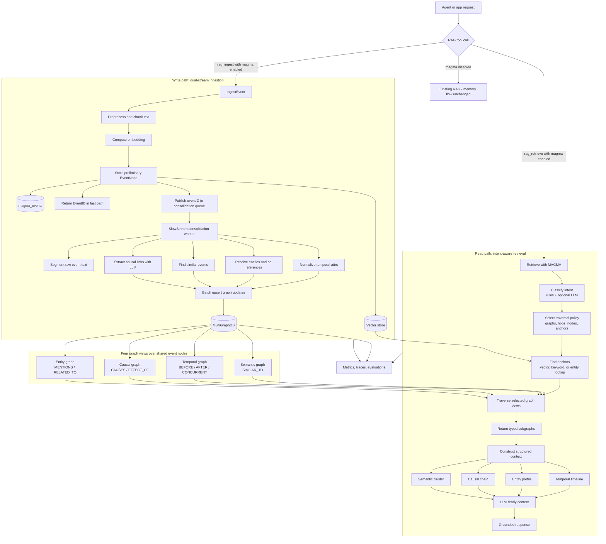

# MAGMA Implementation Plan for Manifold

**Paper:** [MAGMA: A Multi-Graph based Agentic Memory Architecture for AI Agents](https://arxiv.org/abs/2601.03236)  
**Status:** Implementation substantially complete; remaining work is benchmark/evaluation validation  
**Date:** 2026-05-25

---

## 1. Executive Summary

MAGMA replaces monolithic memory retrieval with **four orthogonal relational graphs** (semantic, temporal, causal, entity) over shared event nodes, plus a policy-guided query-time traversal and a dual-stream write pipeline (fast ingestion + asynchronous consolidation).

Manifold already had the foundations:
- `GraphDB` interface with `UpsertNode`, `UpsertEdge`, `Neighbors`, `GetNode`
- In-memory (`memoryGraph`) and Postgres (`pgGraph`) backends
- RAG service with ingest/retrieve, graph augmentation, and hybrid fusion
- Evolving Memory with Search→Synthesis→Evolve loop
- Belief memory with scope, confidence, and evidence

Implemented status: Manifold now has typed MAGMA graph views, fast ingestion plus async consolidation, intent-aware retrieval, RAG/tool integration, observability metrics and tracing, lifecycle pruning, low-confidence review state, and manual edge retraction/approval APIs. Benchmark harnesses and formal performance validation remain outside this plan document.

---

## 2. What MAGMA Introduces (vs. What Manifold Has Today)

| MAGMA Component | Manifold Today | Gap |
|---|---|---|
| **Semantic graph** (concept-to-concept edges) | Single graph with `HAS_CHUNK`, `REFERS_TO` | Need semantic edge types and vector-backed similarity edges |
| **Temporal graph** (event sequencing, normalization) | No temporal reasoning or date normalization | Need chronological backbone with relative-to-absolute date resolution |
| **Causal graph** (cause→effect chains) | No causal edge types | Need causal reasoning over events |
| **Entity graph** (person/thing neighborhoods) | `ExternalRef` nodes only | Need entity resolution, co-reference, and person-centric neighborhoods |
| **Adaptive traversal policy** | Static `ExpandWithGraph` (1-hop, HAS_CHUNK only) | Need intent classification + per-graph traversal budgets |
| **Dual-stream ingestion** | Single-pass ingest | Need fast event stream + async consolidation worker |
| **Structured context construction** | Flat chunk text concatenation | Need type-aligned subgraph fusion into LLM context |

---

## 3. Architecture: Layer-by-Layer Design

### 3.1 Data Structure Layer — Four Orthogonal Graphs

Each memory item (event node) is represented once and linked across four graph views:

```
EventNode {
  id: string              # "event:<session>:<sequence>"
  text: string            # raw utterance or summary
  embedding: []float32    # for semantic similarity lookup
  temporal_attrs: {       # normalized timestamps
    date: string          # "2023-10-19" (resolved from "yesterday")
    relative_to: string   # anchor event ID
    offset: duration
  }
  entity_mentions: [{     # entities referenced in this event
    id: string            # "entity:<canonical-name>"
    type: string          # Person, Organization, Location, etc.
    role: string          # "playing", "son", "friend"
  }]
  semantic_links: [{      # concept similarity to other events
    target_id: string
    similarity: float
  }]
  causal_links: [{        # cause/effect relationships
    target_id: string
    direction: "cause" | "effect"
  }]
}
```

**Graph types:**

| Graph | Edge Types | Storage Strategy |
|---|---|---|
| **Semantic** | `SIMILAR_TO` (bidirectional, weighted) | Computed on ingestion; pruned to top-k per node |
| **Temporal** | `BEFORE`, `AFTER`, `CONCURRENT` (ordered) | Ingested with resolved timestamps; topological sort for ordering |
| **Causal** | `CAUSES`, `EFFECT_OF` (directed) | Extracted by LLM during consolidation |
| **Entity** | `MENTIONS` (entity→event), `RELATED_TO` (entity→entity) | Entity resolution + co-reference during consolidation |

### 3.2 Query Process — Intent-Aware Traversal

```
QueryEngine {
  1. IntentClassifier: classify query into one or more intent categories
     - temporal   ("When did she hike?", "What happened before X?")
     - entity     ("What instruments does Melanie play?", "Who are her friends?")
     - semantic   ("What was she talking about?", "Tell me about music")
     - causal     ("Why did she leave?", "What caused the accident?")
     - mixed      (multiple intents detected)

  2. PolicySelector: for each active intent, select traversal budget
     - graph_view: which graph to traverse
     - max_hops: depth limit (default 1–3)
     - max_nodes: fan-out limit (default 5–10)
     - anchor_selector: find initial anchor nodes via vector search or keyword

  3. GraphTraversal: execute independent traversals per active graph
     - each traversal returns a subgraph of nodes + edges

  4. ContextConstructor: fuse subgraphs into structured context
     - deduplicate events
     - format as type-aligned context (temporal timeline, entity profile, causal chain, semantic cluster)
     - apply relevance ranking across all views
}
```

### 3.3 Write/Update Process — Dual-Stream

```
FastStream (synchronous, < 100ms):
  - Accept incoming event text
  - Compute embedding → index in vector DB
  - Insert preliminary EventNode with raw text
  - Return immediately (no LLM calls)

SlowStream (asynchronous background worker):
  - Event segmentation: split raw events into structured event nodes
  - Temporal normalization: resolve "yesterday", "last week", etc.
  - Entity resolution: canonicalize "Melanie", "she", "my friend" → entity ID
  - Causal extraction: LLM-based cause/effect relationship detection
  - Semantic linking: compute similarity edges to existing events
  - Entity co-reference: merge "Melanie" and "my daughter" if context confirms
  - Graph consolidation: batch upsert nodes and edges across all four views
```

### 3.4 End-to-End Workflow Diagram



---

## 4. Implementation Plan — Phased Rollout

### Phase 1: Core Types & Multi-Graph Infrastructure (Week 1-2)

**New files:**
- `internal/memory/magma/types.go` — EventNode, GraphType, IntentCategory, TraversalPolicy
- `internal/memory/magma/graph_views.go` — SemanticGraph, TemporalGraph, CausalGraph, EntityGraph (logical views over shared GraphDB)
- `internal/persistence/databases/multi_graph.go` — MultiGraphDB interface extending GraphDB with typed edge queries

**Schema changes (Postgres):**
```sql
-- Event nodes (shared across all views)
CREATE TABLE IF NOT EXISTS magma_events (
  id TEXT PRIMARY KEY,
  tenant_id BIGINT NOT NULL,
  session_id TEXT NOT NULL,
  text TEXT NOT NULL,
  embedding VECTOR(1024),  -- or use existing vector store reference
  temporal_attrs JSONB DEFAULT '{}',
  entity_mentions JSONB DEFAULT '[]',
  created_at TIMESTAMPTZ DEFAULT NOW()
);

-- Typed edges (extends existing edges table or uses new table)
CREATE TABLE IF NOT EXISTS magma_edges (
  id BIGSERIAL PRIMARY KEY,
  source TEXT NOT NULL REFERENCES magma_events(id),
  graph_type TEXT NOT NULL CHECK (graph_type IN ('semantic', 'temporal', 'causal', 'entity')),
  rel TEXT NOT NULL,
  target TEXT NOT NULL,
  weight FLOAT8,
  props JSONB DEFAULT '{}'
);
CREATE INDEX IF NOT EXISTS magma_edges_graph_src ON magma_edges(graph_type, source, rel);
CREATE INDEX IF NOT EXISTS magma_edges_graph_dst ON magma_edges(graph_type, target, rel);

-- Entity nodes (separate from event nodes)
CREATE TABLE IF NOT EXISTS magma_entities (
  id TEXT PRIMARY KEY,
  tenant_id BIGINT NOT NULL,
  type TEXT NOT NULL,  -- Person, Organization, Location, etc.
  canonical_name TEXT NOT NULL,
  aliases TEXT[] DEFAULT '{}',
  props JSONB DEFAULT '{}'
);
```

**Key changes to existing code:**
- Extend `databases.GraphDB` with `TypedNeighbors(ctx, id, graphType, rel)` and `TypedUpsertEdge(ctx, src, graphType, rel, dst, props)`
- Add `magma` package to the `Manager` struct as optional backend

### Phase 2: Fast Ingestion Stream (Week 3)

**New files:**
- `internal/memory/magma/fast_ingest.go` — FastStream: embed + store raw event
- `internal/memory/magma/fast_ingest_test.go`

**Integration with existing RAG:**
```go
func (s *Service) IngestEvent(ctx context.Context, in IngestRequest) (EventIngestResponse, error) {
  // 1. Preprocess (reuse existing ingest.Preprocess)
  pre, _ := ingest.Preprocess(ctx, DefaultLanguageDetector{}, in)

  // 2. Chunk + vector embed (reuse existing pipeline)
  chunks, _ := s.chunker.Chunk(pre.Text, in.Options.Chunking)
  vec, _ := s.emb.Embed(ctx, pre.Text)

  // 3. Create EventNode (minimal) and store in vector + graph
  eventID := "event:" + in.Tenant + ":" + generateSequence()
  event := EventNode{
    ID: eventID, Text: pre.Text, Embedding: vec,
    Tenant: in.Tenant, Session: in.SessionID,
  }
  s.magma.StoreEvent(ctx, event)  // Fast path, no LLM
  s.vector.Upsert(ctx, eventID, vec, map[string]string{"tenant": in.Tenant})

  // 4. Enqueue for consolidation
  s.consolidationQueue.Publish(eventID)

  return EventIngestResponse{EventID: eventID, Status: "ingested"}, nil
}
```

### Phase 3: Consolidation Worker (Week 4-5)

**New files:**
- `internal/memory/magma/consolidation.go` — SlowStream worker
- `internal/memory/magma/consolidation/prompts.go` — LLM prompts for extraction
- `internal/memory/magma/consolidation/temporal.go` — Date normalization logic
- `internal/memory/magma/consolidation/entity.go` — Entity resolution
- `internal/memory/magma/consolidation/causal.go` — Causal relationship extraction
- `internal/memory/magma/consolidation/semantic.go` — Similarity-based edge creation

**Consolidation pipeline:**
```go
type ConsolidationPipeline struct {
  LLM       llm.Provider
  Model     string
  Vector    databases.VectorStore
  MultiGraph *MultiGraphDB
}

func (p *ConsolidationPipeline) Consolidate(ctx context.Context, eventID string) error {
  event, _ := p.MultiGraph.GetEvent(ctx, eventID)

  // 1. Temporal normalization
  attrs := NormalizeTemporal(ctx, event.Text, event.CreatedAt)
  
  // 2. Entity resolution
  entities := p.ResolveEntities(ctx, event.Text, attrs)

  // 3. Semantic linking (vector search for similar events)
  similar, _ := p.Vector.SimilaritySearch(ctx, event.Embedding, 20, nil)
  semanticEdges := p.BuildSemanticEdges(ctx, event, similar)

  // 4. Causal extraction (LLM call)
  causalEdges := p.ExtractCausal(ctx, event, entities, similar)

  // 5. Batch upsert across all four views
  p.MultiGraph.BatchUpsert(ctx, BatchUpsertRequest{
    Event: event,
    TemporalAttrs: attrs,
    Entities: entities,
    SemanticEdges: semanticEdges,
    CausalEdges: causalEdges,
  })
  return nil
}
```

### Phase 4: Intent-Aware Query Engine (Week 6-7)

**Context:** This phase builds on existing Manifold RAG, GraphDB, memory, and beliefs rather than replacing them.

**New files:**
- `internal/memory/magma/query/intent_classifier.go` — Query intent detection
- `internal/memory/magma/query/traversal_policy.go` — Policy selection
- `internal/memory/magma/query/traversal.go` — Multi-graph traversal
- `internal/memory/magma/query/context_constructor.go` — Subgraph fusion
- `internal/memory/magma/query/query_engine.go` — Top-level QueryEngine
**New files:**
- `internal/memory/magma/query/intent_classifier.go` — Query intent detection
- `internal/memory/magma/query/traversal_policy.go` — Policy selection
- `internal/memory/magma/query/traversal.go` — Multi-graph traversal
- `internal/memory/magma/query/context_constructor.go` — Subgraph fusion
- `internal/memory/magma/query/query_engine.go` — Top-level QueryEngine

**Intent classifier (rule-based + LLM hybrid):**
```go
type IntentCategory int
const (
  IntentTemporal IntentCategory = 1 << iota  // "When...", "Before/after..."
  IntentEntity                                // "Who...", "What instruments..."
  IntentSemantic                             // "Tell me about...", "What was she talking about"
  IntentCausal                               // "Why...", "What caused..."
)

func ClassifyIntent(query string) (IntentCategory, float64) {
  // Rule-based first pass (fast, low-latency)
  score := IntentCategory(0)
  if strings.Contains(strings.ToLower(query), "when") || 
     strings.Contains(strings.ToLower(query), "before") ||
     strings.Contains(strings.ToLower(query), "after") {
    score |= IntentTemporal
  }
  if strings.Contains(strings.ToLower(query), "who") ||
     strings.Contains(strings.ToLower(query), "what instruments") {
    score |= IntentEntity
  }
  // Add more rules...
  
  // If rule-based score is ambiguous (score == 0 or score has >2 bits), fall back to LLM
  if score == 0 || bits.OnesCount(uint(score)) > 2 {
    return LLMClassifyIntent(ctx, llmProvider, query)
  }
  return score, confidence
}
```

**Traversal policy:**
```go
type TraversalPolicy struct {
  Intent         IntentCategory
  GraphViews     []GraphType       // which graphs to traverse
  MaxHops        int               // per-graph depth
  MaxNodes       int               // fan-out limit
  AnchorStrategy AnchorType        // vector, keyword, or entity lookup
}

func SelectPolicy(intent IntentCategory) TraversalPolicy {
  switch {
  case intent&IntentTemporal != 0:
    return TraversalPolicy{GraphViews: []GraphType{GraphTemporal, GraphSemantic}, MaxHops: 2, MaxNodes: 10}
  case intent&IntentEntity != 0:
    return TraversalPolicy{GraphViews: []GraphType{GraphEntity, GraphSemantic}, MaxHops: 1, MaxNodes: 5}
  case intent&IntentCausal != 0:
    return TraversalPolicy{GraphViews: []GraphType{GraphCausal, GraphTemporal}, MaxHops: 3, MaxNodes: 10}
  default:
    return TraversalPolicy{GraphViews: []GraphType{GraphSemantic}, MaxHops: 2, MaxNodes: 10}
  }
}
```

### Phase 5: Context Construction & LLM Integration (Week 8)

**New files:**
- `internal/memory/magma/context/templates.go` — Context formatting templates
- `internal/memory/magma/context/formatter.go` — Structured context builder

**Context construction:**
```go
type StructuredContext struct {
  TemporalTimeline []TimelineEntry    // events sorted chronologically
  EntityProfile    map[string]EntityProfile  // entity -> {events, relations, attributes}
  CausalChain      []CausalLink          // cause -> effect chains relevant to query
  SemanticCluster  []SemanticGroup       // thematically related event clusters
  RawEvents        []EventNode           // full event nodes for LLM
}

func (c *ContextConstructor) Build(ctx context.Context, traversals map[GraphType]Subgraph) StructuredContext {
  // 1. Collect all unique event IDs across traversals
  // 2. Fetch full event nodes
  // 3. Construct temporal timeline (sort by normalized date)
  // 4. Build entity profiles (group events by entity mentions)
  // 5. Extract causal chains (follow CAUSES/EFFECT_OF edges)
  // 6. Cluster semantically (group by vector proximity)
  // 7. Format as LLM-friendly context string
}
```

### Phase 6: Integration with Existing Systems (Week 9-10)

**Integration points:**

| Existing Component | MAGMA Integration |
|---|---|
| `rag_ingest` tool | Add `magma: true` option to trigger MAGMA ingestion alongside standard RAG |
| `rag_retrieve` tool | Add `magma: true` option to use MAGMA query engine instead of (or alongside) hybrid retrieval |
| Evolving Memory | MAGMA as optional backend for long-term storage; EvolvingMemory still handles session-local |
| Belief Memory | Beliefs can be stored as a special event type with enforcement/confidence in entity graph |
| Transit | Use Transit for cross-session MAGMA memory sharing |
| Graph augmentation | Replace/augment `ExpandWithGraph` with MAGMA's policy-guided traversal |

**Tool schema extensions:**
```json
{
  "rag_ingest": {
    "options": {
      "magma": {
        "enabled": true,
        "graphs": ["semantic", "temporal", "causal", "entity"],
        "consolidation_model": "gpt-4o-mini",
        "top_semantic_k": 20
      }
    }
  },
  "rag_retrieve": {
    "magma": {
      "enabled": true,
      "intent_hint": "temporal|entity|causal|semantic|auto",
      "max_hops": 2,
      "max_nodes": 10,
      "context_format": "structured"
    }
  }
}
```

### Phase 7: Observability, Metrics & Testing (Week 11-12)

**Metrics instrumented:**
- Ingestion: `magma_ingestion_fast_ms`, `magma_ingestion_consolidation_ms`, `magma_events_total`
- Retrieval: `magma_query_ms`, `magma_traversal_hops`, `magma_context_tokens`, `magma_intent_distribution`
- Quality/lifecycle: `magma_consolidation_success_rate`, `magma_entity_resolution_accuracy`, `magma_lifecycle_events_deleted`, `magma_lifecycle_edges_deleted`, `magma_lifecycle_edges_flagged_review`

**Trace spans instrumented:**
- `magma.ingest`
- `magma.consolidate`
- `magma.query`
- `magma.query.classify_intent`
- `magma.query.anchors`
- `magma.query.traverse`
- `magma.prune`
- `magma.approve_edge`
- `magma.retract_edge`

**Test strategy:**
1. Unit tests for temporal normalization (relative → absolute date resolution) — implemented
2. Unit tests for entity resolution (co-reference across events) — implemented
3. Integration tests for graph traversal (multi-hop paths) — implemented
4. Lifecycle tests for TTL pruning, semantic edge pruning, fanout simplification, review approval, and retraction — implemented
5. Trace span tests for MAGMA ingest/consolidation/query/prune — implemented
6. Evaluation against LoCoMo dataset (reproduce MAGMA benchmark results) — remaining
7. Evaluation against LongMemEval (multi-session counting/aggregation) — remaining

---

## 5. Dependencies & Configuration

### New dependencies:
- None required beyond what Manifold already uses (pgx for Postgres, existing LLM client)
- Optional: `github.com/johnson1981/go-ner` for entity extraction, or rely on LLM-based extraction

### Configuration (`config.yaml`):
```yaml
magma:
  enabled: true
  consolidation:
    model: "gpt-4o-mini"
    batchSize: 10
    maxQueueSize: 1000
    workerCount: 2
    prompts:
      consolidationExtraction: "Extract MAGMA memory structure..."
      intentClassification: "Classify the memory retrieval query..."
  graphs:
    semantic:
      enabled: true
      topK: 20
      similarityThreshold: 0.7
    temporal:
      enabled: true
      dateResolution: "auto"
    causal:
      enabled: true
      llmThreshold: 0.8
    entity:
      enabled: true
      coReference: true
  retrieval:
    defaultHops: 2
    defaultMaxNodes: 10
    intentClassification: "hybrid"  # "rules", "llm", or "hybrid"
    contextFormat: "structured"
  lifecycle:
    pruneIntervalMinutes: 0
    eventTTLHours: 0
    maxEdgesPerSourceRel: 0
    minSemanticWeight: 0
    lowConfidenceThreshold: 0.6
    requireReviewApproval: false
```

---

## 6. Risk Assessment & Mitigations

| Risk | Impact | Mitigation |
|---|---|---|
| Consolidation latency (LLM calls) | Slow graph construction | Async workers, batching, cache consolidation results |
| Entity resolution errors | Wrong entity linking | Confidence thresholds, review-state APIs, retractable edges |
| Graph size growth | Query performance degradation | TTL expiration, semantic edge weight pruning, per-source/relation fanout simplification |
| Causal extraction hallucination | Incorrect reasoning | Require high LLM confidence, flag low-confidence edges, optionally gate retrieval on review approval |
| Integration complexity | Breaking existing RAG flow | Opt-in via config, backward-compatible tool schemas |

---

## 7. File Structure (Target Layout)

```
repos/manifold/
├── internal/
│   ├── memory/
│   │   └── magma/                          # New MAGMA package
│   │       ├── types.go                    # EventNode, GraphType, IntentCategory
│   │       ├── graph_views.go              # Semantic/Temporal/Causal/Entity views
│   │       ├── fast_ingest.go              # Fast ingestion stream
│   │       ├── consolidation.go            # Consolidation pipeline orchestrator
│   │       ├── consolidation/
│   │       │   ├── prompts.go              # LLM extraction prompts
│   │       │   ├── temporal.go             # Date normalization
│   │       │   ├── entity.go               # Entity resolution
│   │       │   ├── causal.go               # Causal extraction
│   │       │   └── semantic.go             # Similarity edge creation
│   │       ├── query/
│   │       │   ├── intent_classifier.go    # Intent detection
│   │       │   ├── traversal_policy.go     # Policy selection
│   │       │   ├── traversal.go            # Multi-graph traversal
│   │       │   ├── context_constructor.go  # Subgraph fusion
│   │       │   └── query_engine.go         # Top-level query engine
│   │       ├── context/
│   │       │   ├── templates.go            # Context formatting
│   │       │   └── formatter.go            # Structured context builder
│   │       └── service.go                  # MAGMA service (integrates with RAG service)
│   ├── persistence/
│   │   └── databases/
│   │       ├── multi_graph.go              # MultiGraphDB interface
│   │       ├── postgres_multi_graph.go     # Postgres implementation
│   │       └── memory_multi_graph.go       # In-memory implementation
│   ├── tools/
│   │   └── rag/
│   │       └── tool.go                     # Extended with MAGMA options
│   └── agent/
│       └── memory/
│           ├── evolving.go                 # Extended to optionally use MAGMA
│           └── evolving_types.go           # MAGMA config fields
```

---

## 8. Success Criteria

1. **Functional:** All four graph views operational with typed edges and traversal
2. **Performance:** Fast ingestion < 100ms p99; query latency within 2x current RAG retrieval
3. **Quality:** ≥ 85% of MAGMA benchmark results on LoCoMo (targeting top-tier performance)
4. **Integration:** `rag_ingest` and `rag_retrieve` support MAGMA via opt-in config
5. **Observability:** Full metrics and tracing for ingestion and retrieval pipelines
6. **Backward Compatibility:** Existing RAG flow unchanged when MAGMA is disabled

---

## 9. References

- Paper: [MAGMA: A Multi-Graph based Agentic Memory Architecture for AI Agents](https://arxiv.org/abs/2601.03236)
- Source: [github.com/FredJiang0324/MAGMA](https://github.com/FredJiang0324/MAGMA)
- Existing Manifold RAG: `internal/rag/`, `internal/tools/rag/`
- Existing GraphDB: `internal/persistence/databases/graph_*.go`
- Existing Memory: `internal/agent/memory/`
- Existing Beliefs: `internal/agent/belief/`
