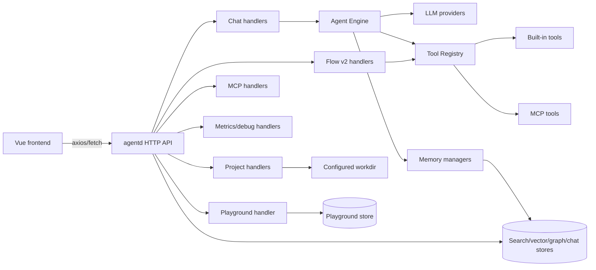
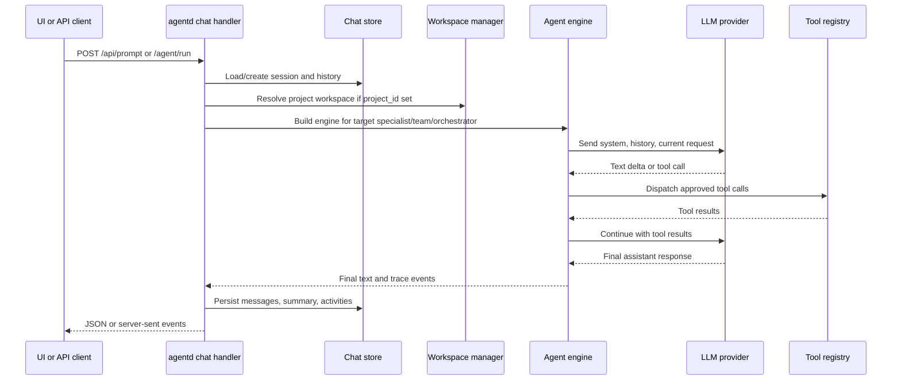
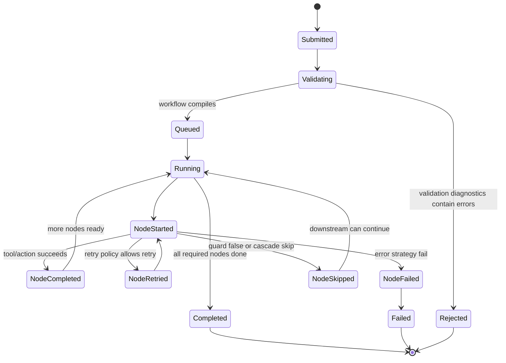
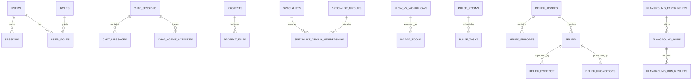
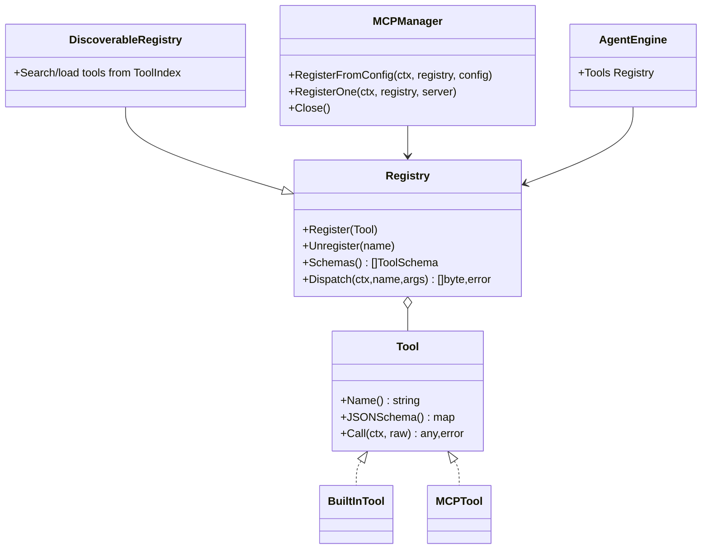

# Diagram Catalog

This page gathers the most important Mermaid diagrams for onboarding. Each diagram uses the diagram type that best matches the information being shown.

## Component Map (`flowchart`)

Use this to understand where code changes usually land.

**Evidence:** `internal/agentd/router.go`, `internal/agentd/app_init.go`, `internal/agent/engine*.go`, `web/agentd-ui/src/api/*`.

## Chat Request (`sequenceDiagram`)

Use this when changing chat handlers, streaming, or agent execution.

**Evidence:** `internal/agentd/handlers_chat.go`, `internal/agentd/chat_handler_setup.go`, `internal/agentd/chat_execution.go`, `internal/agent/engine_loop.go`, `internal/agent/engine_tools.go`.

## Workflow Lifecycle (`stateDiagram-v2`)

Use this for Flow v2 run state and event behavior.

**Evidence:** `internal/flow/types.go`, `internal/flow/compiler.go`, `internal/agentd/flow_v2_runtime.go`, `docs/parallel-execution-plan.md`.

## Persistence Overview (`erDiagram`)

Use this for database-impacting changes.

**Evidence:** SQL initialization in `internal/auth/store.go`, `internal/persistence/databases/*.go`, `internal/codeqa/store/postgres.go`.

## Tool Model (`classDiagram`)

Use this when changing built-in tools or MCP registration.

**Evidence:** `internal/tools/types.go`, `internal/tools/registry*.go`, `internal/tools/discovery/*`, `internal/mcpclient/*`, `internal/agent/engine.go`.
