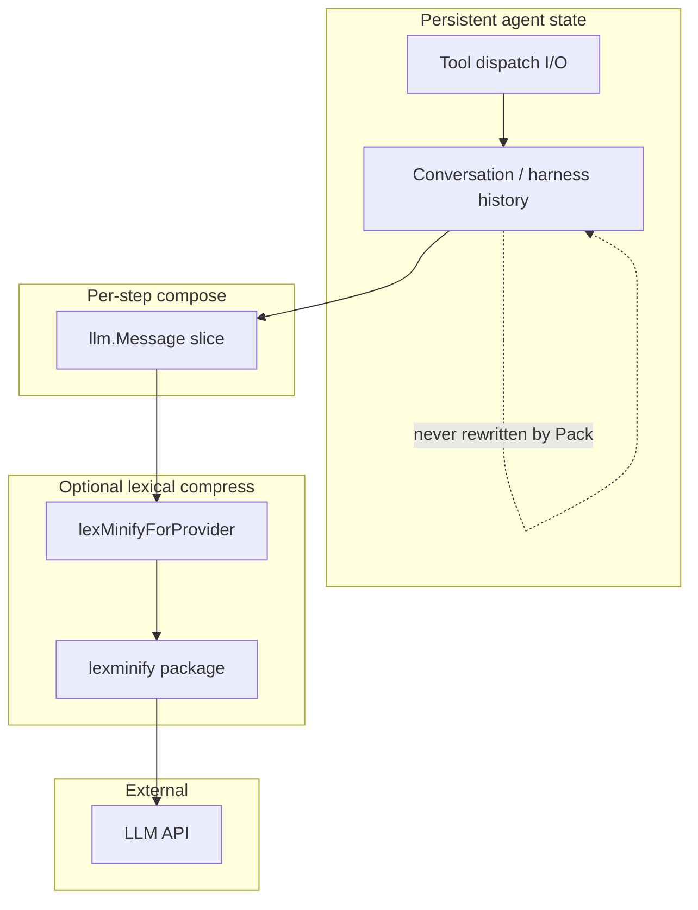

# Architecture Overview (lexminify slice)

Manifold’s agent engine assembles multi-role message lists, optionally runs rolling summarization / context budgeting, then issues provider calls. **lexminify** is a late, pure-function stage on the **provider-visible** copy:

Why this cut:

- Cheap deterministic density before tokens burn
- No second model in the compression path
- Zones let experiments toggle system vs tool vs history without forked pipelines

Deeper package detail: [components/lexminify.md](../components/lexminify.md). Runtime timing: [flows/lexminify-provider-path.md](../flows/lexminify-provider-path.md).