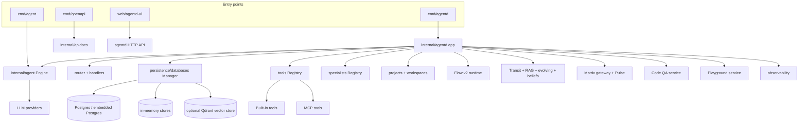

# Architecture Overview

This page explains Manifold as a contributor-facing system: what the main runtime does, how the packages depend on each other, and where changes usually land.

## Mental Model

Manifold is a Go backend with an embedded Vue frontend. The backend (`agentd`) exposes a web UI, HTTP APIs, agent chat, tool execution, workflow execution, project-scoped workspaces, memory systems, specialists/teams, Matrix/Pulse integrations, Code QA, and a prompt experiment playground.

The dominant integration point is `internal/agentd`: it creates the app, wires storage, registers tools, serves routes, and coordinates long-lived runtimes.

**Evidence:** `cmd/agentd/main.go`, `cmd/agent/main.go`, `cmd/openapi/main.go`, `internal/agentd/app_init.go`, `internal/persistence/databases/factory.go`, `web/agentd-ui/package.json`.

## Dependency Direction

The safest way to reason about changes is by dependency direction:

1. `cmd/*` binaries are thin entrypoints.
2. `internal/agentd` composes services and owns HTTP integration.
3. Domain packages (`agent`, `flow`, `projects`, `transit`, `rag`, `codeqa`, `playground`, `matrixgw`, `pulse`) implement behavior.
4. Infrastructure packages (`persistence/databases`, `llm`, `tools`, `observability`, `config`, `auth`, `sandbox`) provide reusable capabilities.
5. `web/agentd-ui` consumes the HTTP API.

Avoid making lower-level packages import `internal/agentd`; keep `agentd` as the composition layer.

## Runtime Responsibilities

| Runtime part | Responsibility | Key files |
| --- | --- | --- |
| `agentd` app | Config load, app initialization, HTTP server, tool and service wiring | `internal/agentd/app_init.go`, `internal/agentd/run.go`, `internal/agentd/router.go` |
| Agent engine | LLM loop, message assembly, tool calls, streaming, delegation, summaries, memories | `internal/agent/engine*.go`, `internal/agent/messages.go` |
| Tool registry | Built-in tool schemas, dispatch, filtering, discovery, MCP tool registration | `internal/tools/**`, `internal/tools/discovery/**`, `internal/mcpclient/**` |
| Persistence manager | Chooses memory/Postgres/Qdrant/noop backends and initializes stores | `internal/persistence/databases/factory.go` |
| Projects/workspaces | Filesystem-backed per-user projects and sandbox roots | `internal/projects/service.go`, `internal/workspaces/manager.go`, `internal/sandbox/pathpolicy.go` |
| Flow v2 | Workflow schema, validation, run runtime, saved workflow tools | `internal/flow/*`, `internal/agentd/flow_v2_runtime.go`, `internal/tools/warpptool/*` |
| Memory systems | Transit, RAG, evolving memory, belief memory, policy enforcement | `internal/transit/*`, `internal/rag/**`, `internal/agent/memory/**`, `internal/agent/belief/**`, `internal/policy/**` |
| UI | Vue views, stores, API clients, feature-gated routes | `web/agentd-ui/src/*` |

## High-Risk Cross-Cutting Concerns

- **Path safety:** project file access, CLI execution, file tools, MCP path-dependent servers.
- **Auth scoping:** user-specific chat sessions, projects, specialists, Transit records, playground data.
- **Streaming contracts:** `/api/prompt`, `/agent/run`, Flow v2 events, CodeQA events.
- **Persistence schema:** application-created tables and migrations should not diverge.
- **Tool exposure:** allow lists, auto-discovery, specialist-specific tools, and MCP tools can change model capabilities.
- **Memory prompt injection:** RAG and memory content must remain clearly separated from authoritative instructions.
- **Long-running work:** delegated agents, teams, workflows, CodeQA, and Matrix/Pulse must respect cancellation and run bounds.

## Evidence

- `README.md` describes Manifold as experimental long-horizon workflow automation with teams of AI assistants.
- `internal/agentd/app_init.go` wires stores, tools, RAG, Transit, specialists, MCP, CodeQA, workspaces, and memory.
- `internal/agentd/router.go` registers the backend HTTP surface.
- `internal/persistence/databases/factory.go` selects storage backends.
- `web/agentd-ui/src/router/index.ts` maps the primary UI routes.
