# Repository Map

This page maps the repository by contributor workflow.

## Top-Level Files and Directories

| Path | Purpose |
| --- | --- |
| `README.md` | Product overview, feature list, experimental warning, deployment fast path. |
| `QUICKSTART.md` | Fresh-clone deployment guide. |
| `Makefile` | Build, test, frontend, OpenAPI, lint, and CI-like targets. |
| `go.mod`, `go.sum` | Go module and dependencies. |
| `config.yaml.example` | Primary runtime configuration reference. |
| `example.env` | Environment template for secrets and config interpolation. |
| `mcp.yaml.example` | MCP server configuration examples. |
| `specialists.yaml.example` | Specialist registry examples. |
| `docker-compose.yml` | Local deployment services: Manifold, Postgres, optional ClickHouse/OTel/Keycloak. |
| `cmd/` | Go binary entrypoints. |
| `internal/` | Go backend packages. |
| `web/agentd-ui/` | Vue frontend. |
| `docs/` | Existing user and operator docs. |
| `deploy/` | Dockerfiles, service configs, migrations, local development deployment aids. |
| `scripts/` | Helper scripts. |

## Backend Package Map

```mermaid
flowchart TB
    internal[internal]
    internal --> agentd[agentd: server integration]
    internal --> agent[agent: LLM loop]
    internal --> tools[tools: built-in tool surface]
    internal --> llm[llm: provider abstractions]
    internal --> persistence[persistence/databases: stores]
    internal --> config[config: YAML/env loading]
    internal --> auth[auth: OIDC/OAuth2/RBAC]
    internal --> projects[projects: filesystem project service]
    internal --> workspaces[workspaces: active project checkout]
    internal --> sandbox[sandbox: path policy]
    internal --> flow[flow: workflow schema/compiler]
    internal --> transit[transit: shared memory service]
    internal --> rag[rag: ingest/retrieve service]
    internal --> mcpclient[mcpclient: MCP client and pool]
    internal --> specialists[specialists: registry/routing]
    internal --> matrixgw[matrixgw: Matrix sync/post]
    internal --> pulse[pulse: scheduled tasks]
    internal --> codeqa[codeqa: gates/judge/optimize]
    internal --> playground[playground: prompts/datasets/experiments]
    internal --> observability[observability: logs/traces/metrics]
    internal --> webui[webui: embedded UI serving]
```

## Important Subpackages

| Package | What to read first | Notes |
| --- | --- | --- |
| `internal/agentd` | `app.go`, `app_init.go`, `run.go`, `router.go` | Main integration layer. |
| `internal/agent` | `engine.go`, `engine_loop.go`, `engine_run.go`, `engine_tools.go` | Agent execution, tool loop, streaming, delegation. |
| `internal/tools` | `types.go`, `registry*`, tool subdirectories | Tool schema and dispatch model. |
| `internal/persistence/databases` | `factory.go`, `interfaces.go`, `*_store_*.go` | Storage backends and schema initialization. |
| `internal/flow` | `types.go`, `compiler.go`, `contracts.go` | Workflow data model and validation. |
| `internal/agentd/flow_v2_runtime.go` | entire file | Runtime execution and events for Flow v2. |
| `internal/projects` | `service.go` | Filesystem project operations. |
| `internal/workspaces` | `manager.go` | Workspace resolution from project IDs. |
| `internal/sandbox` | `pathpolicy.go`, `workdir.go` | Path containment rules. |
| `internal/mcpclient` | `mcpclient.go`, `pool.go` | MCP registration and per-user sessions. |
| `internal/transit` | `types.go`, `service.go`, `store.go` | Durable shared memory. |
| `internal/rag` | `service/service.go`, `ingest/`, `retrieve/` | Hybrid document retrieval. |
| `internal/agent/memory` | `README.md`, manager/evolving files | Chat and evolving memory. |
| `internal/agent/belief` | `types.go`, retriever/distiller files | Belief memory model. |
| `internal/codeqa` | `service/`, `gates/`, `judge/` | Code quality evaluation. |
| `internal/playground` | `api.go`, `types.go`, package subdirs | Prompt experiments. |

## Frontend Map

| Path | Purpose |
| --- | --- |
| `web/agentd-ui/src/router/index.ts` | UI routes and feature-gated pages. |
| `web/agentd-ui/src/api/*` | API clients for backend features. |
| `web/agentd-ui/src/stores/*` | Pinia state for chat, projects, flow runs, playground, theme. |
| `web/agentd-ui/src/views/*` | Page-level Vue views. |
| `web/agentd-ui/src/components/*` | Reusable UI components and feature-specific panels. |
| `web/agentd-ui/src/types/*` | Shared frontend types. |
| `web/agentd-ui/tests` and `web/agentd-ui/e2e` | Unit and Playwright tests. |

## Test Distribution Snapshot

A repository crawl found tests across most backend packages. High-test-count areas include `internal/agentd`, `internal/tools`, `internal/agent`, `internal/persistence`, `internal/rag`, `internal/llm`, and `internal/codeqa`. Use package-local tests as the first validation target for focused changes.

## Evidence

- Directory crawl of `repos/manifold` and `repos/manifold/internal`.
- `web/agentd-ui/src/router/index.ts` for frontend route map.
- `go.mod` and `web/agentd-ui/package.json` for ecosystem detection.
