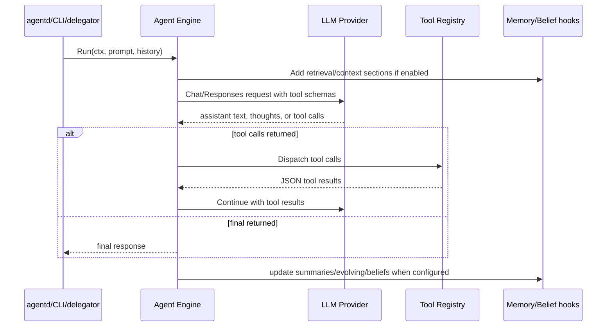

# Component: Agent Engine

The agent engine is the LLM reasoning and tool-use loop used by chat, specialist delegation, the CLI agent, and some workflows.

## Core Concepts

| Concept | Where | Purpose |
| --- | --- | --- |
| `Engine` | `internal/agent/engine.go` | Holds LLM provider, tool registry, system prompt, limits, memory, delegation, and policy hooks. |
| Initial messages | `internal/agent/messages.go` | Builds system, history, and current request messages with explicit markers. |
| Run loop | `internal/agent/engine_loop.go`, `engine_run.go`, `engine_stream.go` | Calls LLM, handles tool calls, streams events, stops on final answer or limits. |
| Tool execution | `internal/agent/engine_tools.go` | Dispatches tool calls and serializes results. |
| Delegation | `internal/agent/delegate.go`, `internal/tools/agents/*` | Lets agents call specialists or teams and emit nested traces. |
| Summarization | `internal/agent/engine_summarization.go`, `internal/agentd/chat_handler_setup.go` | Condenses long histories before model calls. |
| Memory | `internal/agent/engine_memory.go`, `internal/agent/memory/*` | Attaches evolving memory and chat memory context. |
| Beliefs | `internal/agent/engine_belief*.go`, `internal/agent/belief/*` | Distills, retrieves, promotes, or enforces belief/policy context. |

## Agent Loop

## Message Safety Markers

`BuildInitialLLMMessages` marks prior conversation as `[CONVERSATION HISTORY]` and the new user request as `[CURRENT REQUEST]`. This is important for long-running sessions: history is context, not a new instruction to satisfy.

## Tool Results Are Data

Tools generally return structured JSON. Tool errors are commonly encoded as data rather than panicking so the model can recover. Changing tool error shape can affect model behavior and frontend traces.

## Streaming

The engine can stream deltas, tool events, delegated-agent traces, thoughts, images, TTS chunks, summaries, and final responses through `agentd` transport wrappers. Any change to stream event names or payload fields should be coordinated with `web/agentd-ui/src/api/chat.ts` and chat store/view code.

## Delegation

Delegated runs use `DelegateRequest` and `Delegator`. Specialist and team calls can inherit project, objective, session, user, and memory context. Nested traces include call IDs and depth so the UI can render agent threads.

## Risk Areas

- Step limits and cancellation.
- Tool call ordering and parallelism.
- Stream event compatibility.
- Prompt injection boundaries for history, RAG, Transit, and beliefs.
- Policy enforcement before tool execution.
- Specialist/team context inheritance.

## Evidence

- `internal/agent/messages.go` defines history/current request markers.
- `internal/agent/delegate.go` defines delegated agent trace and request contracts.
- `internal/agent/engine*.go` files implement run, stream, tools, memory, budget, summarization, and belief behavior.
- `internal/agentd/chat_execution.go` bridges engine output to HTTP JSON/SSE.
