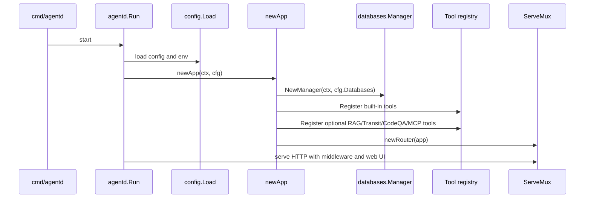

# Component: `agentd` Server

`internal/agentd` is the main runtime integration package. It turns config into a running Manifold server.

## Responsibilities

- Load runtime configuration and environment values.
- Initialize logging and OpenTelemetry/local observability.
- Start embedded Postgres when configured.
- Build LLM providers and summary provider.
- Build persistence manager and stores.
- Register built-in tools, RAG tools, Transit tools, CodeQA tools, image/TTS tools, specialist delegation tools, and MCP tools.
- Build specialist registries and user-specific registries.
- Configure project/workspace services.
- Start Matrix/Pulse and evolving memory janitors.
- Register HTTP routes and serve embedded UI assets.

## Key Files

| File | Role |
| --- | --- |
| `cmd/agentd/main.go` | Tiny binary entrypoint. |
| `internal/agentd/run.go` | Runtime bootstrap and server lifecycle. |
| `internal/agentd/app.go` | App struct and shared runtime fields. |
| `internal/agentd/app_init.go` | Main composition root. |
| `internal/agentd/router.go` | HTTP route registration. |
| `internal/agentd/server_lifecycle.go` | Middleware and server lifecycle support. |
| `internal/agentd/*handlers*.go` | Feature-specific HTTP handlers. |
| `internal/agentd/chat_*.go` | Chat request setup, execution, streaming, titles, dispatch. |
| `internal/agentd/flow_v2_runtime.go` | Workflow runtime. |
| `internal/agentd/matrix_*.go` | Matrix gateway integration and Pulse. |
| `internal/agentd/*clickhouse*.go`, `process_metrics.go` | Metrics, traces, logs, and local/persistent observability. |

## App Initialization Stages

1. Start embedded Postgres if configured.
2. Create instrumented HTTP client and LLM providers.
3. Build `databases.Manager` from DB config.
4. Build `cli.Executor` and CodeQA service.
5. Register tools into `tools.Registry`.
6. Create RAG embedder and RAG service.
7. Optionally create Transit service and tools.
8. Create image, agent delegation, ask-agent, and team delegation tools.
9. Register configured and persisted MCP servers.
10. Build specialists registry and tool discovery index.
11. Initialize chat memory, evolving memory, belief memory, auth, web UI, Flow v2, CodeQA runtime, Matrix gateway, and Pulse runtime.

## Route Groups

`router.go` registers routes for:

- OpenAPI and docs;
- playground;
- auth and users;
- preferences;
- health/readiness;
- projects;
- Matrix rooms;
- CodeQA;
- runs and chat sessions;
- Transit;
- status, specialists, teams;
- metrics and config;
- Flow v2;
- agent run, vision, prompt;
- audio and speech-to-text;
- MCP;
- memory and belief debug endpoints.

See [HTTP API](../interfaces/http-api.md).

## What to Watch When Modifying `agentd`

- Do not duplicate domain logic in handlers if a domain package already exists.
- Keep auth and tenant scoping consistent across list/get/update/delete handlers.
- Preserve CORS and streaming behavior for chat, Flow, and CodeQA endpoints.
- When adding a tool, update the tool catalog and consider allow-list/discovery behavior.
- When adding a route, update `internal/apidocs/spec.go`, tests, and frontend clients if needed.

## Evidence

- `cmd/agentd/main.go` calls `agentd.Run()`.
- `internal/agentd/app_init.go` contains `newApp` and tool/service registration.
- `internal/agentd/router.go` contains route registrations.
- `internal/agentd/app.go` defines the app fields and adapters.
