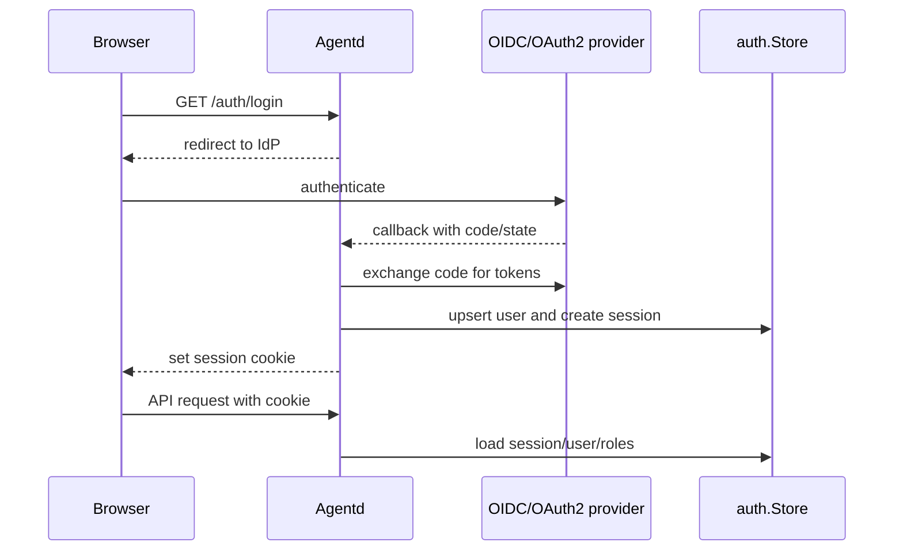

# Component: Auth and Observability

Auth and observability are optional layers around the core runtime.

## Authentication and RBAC

Manifold supports OIDC/OAuth2 login and Postgres-backed RBAC.

Tables are created in `internal/auth/store.go`: `users`, `roles`, `user_roles`, and `sessions`.

## Observability Modes

| Mode | Description | Evidence |
| --- | --- | --- |
| Local process telemetry | Bounded in-process metrics/logs/traces for dashboard without ClickHouse | `docs/observability.md`, `internal/agentd/process_metrics.go` |
| OTLP export | Exports traces/metrics/logs via OpenTelemetry | `internal/observability/*`, `deploy/configs/otel/collector.yaml` |
| ClickHouse-backed dashboard | Persistent query backend for logs/traces/metrics | `internal/agentd/*clickhouse*.go`, `docker-compose.yml` |

## Metrics Routes

`router.go` registers token, memory, traces, logs, and log detail metric endpoints. The UI has observability components and composables for token, trace, log, and memory panels.

## Contributor Guidance

- Keep auth optional; routes must handle both authenticated and unauthenticated modes correctly.
- User-specific data should be tenant/user scoped when auth is enabled.
- Session cookies are security-sensitive; coordinate any cookie changes with docs and frontend account behavior.
- Observability should redact secrets and avoid logging raw prompts unless explicitly configured.
- Prefer structured logs and trace IDs for long-running flows.

## Evidence

- `internal/auth/store.go`, `middleware.go`, `oidc.go`, `oauth2.go`.
- `internal/agentd/auth_init.go`, `handlers_auth.go`, `router.go`.
- `docs/auth.md` and `docker-compose.yml` for Keycloak local testing.
- `internal/observability/*`, `internal/agentd/metrics_clickhouse.go`, `logs_clickhouse.go`, `traces_clickhouse.go`, `process_metrics.go`.
- `docs/observability.md` and `deploy/configs/otel/collector.yaml`.
