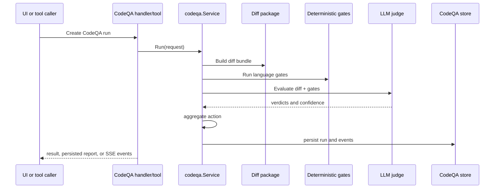

# Component: Code QA

Code QA evaluates code diffs with deterministic gates and LLM-assisted judging. It is available through HTTP endpoints and agent tools.

## Main Packages

| Package | Purpose |
| --- | --- |
| `internal/codeqa/types.go` | Run request/result, gates, judge verdict, aggregate, events. |
| `internal/codeqa/config.go` | Runtime options from config. |
| `internal/codeqa/gates` | Language-specific deterministic gates. |
| `internal/codeqa/diff` | Diff packaging. |
| `internal/codeqa/judge` | LLM judge prompt, rubric, parsers. |
| `internal/codeqa/service` | Run orchestration, report generation, accessors. |
| `internal/codeqa/store` | Memory/Postgres run/event persistence. |
| `internal/tools/codeqa` | Agent tools: judge, run/gate, optimize. |
| `internal/agentd/handlers_codeqa.go` | HTTP API and event streaming. |

## Run Flow

## Modes

The tool layer exposes:

- `code_qa_judge`: judge/evaluate a diff;
- `code_qa_run`: run gate-style evaluation;
- `code_qa_optimize`: generate/evaluate small candidate edits;
- `code_evolve`: AlphaEvolve-style source evolution for a target file.

## Safety Controls

`CodeQAConfig` includes artifact directory, concurrency limits, max diff bytes/files, thresholds, judge/proposer models, allowed commands, high-risk globs, forbidden globs, and auto-apply/commit flags.

## Contributor Guidance

- Keep deterministic gates fast and non-interactive.
- Do not auto-apply changes unless config explicitly allows it.
- Respect repository path resolution and project sandboxing.
- Persist events for long-running UI feedback.
- Add tests for language detection, gate execution, judge parsing, and store behavior.

## Evidence

- `internal/codeqa/config.go`, `types.go`, `service/run.go`, `store/postgres.go`.
- `internal/tools/codeqa/tool.go`, `internal/tools/codeevolve/tool.go`.
- `internal/agentd/handlers_codeqa.go` and tests.
- `web/agentd-ui/src/api/codeqa.ts`, `src/views/CodeQaView.vue`.
