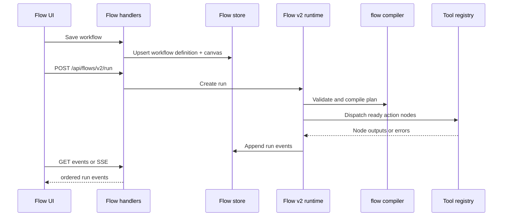
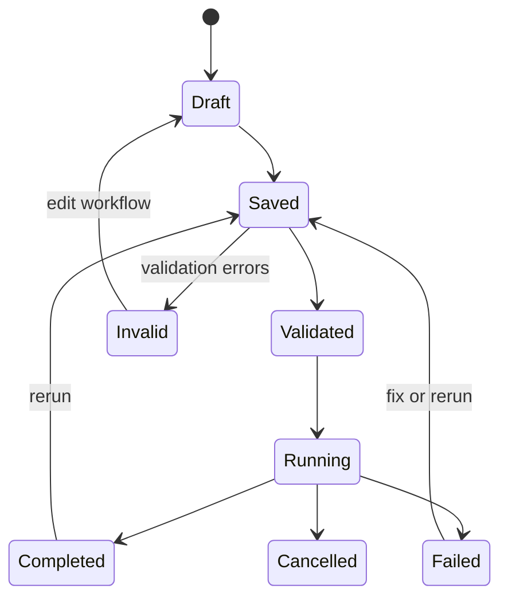

# Component: Flow v2

Flow v2 is Manifold's visual/workflow runtime. It lets users define workflows, validate them, run them, stream events, and expose saved workflows as tools.

## Data Model

`internal/flow/types.go` defines:

- `Workflow`: ID, name, description, keywords, project ID, trigger, nodes, edges, settings.
- `Trigger`: manual, schedule, webhook, event.
- `Node`: ID, name, kind, type, guard, tool, inputs, execution policy, publish settings.
- `Edge`: source/target ports and optional mappings.
- `WorkflowSettings`: max concurrency and default execution config.
- `WorkflowCanvas`: editor-only layout metadata.

## Compiler

`internal/flow/compiler.go` validates workflows and builds a plan with node order, incoming edges, outgoing edges, and indegree counts. Diagnostics are structured with severity, code, message, and path.

## Runtime

`internal/agentd/flow_v2_runtime.go` executes workflow runs. Runtime responsibilities include:

- loading saved workflows;
- creating run IDs and events;
- validating and compiling;
- resolving node inputs;
- dispatching tool/action nodes;
- handling retries and `on_error` strategies;
- honoring guards/skips;
- streaming or returning run events;
- registering saved workflows as `warpp_*` tools.

## Workflow State

## Saved Workflows as Tools

`internal/tools/warpptool/warpp_tool.go` registers one tool per workflow using `warpp_` plus a sanitized workflow ID. Tool callers provide a natural language `query`, and the runtime invokes the saved workflow synchronously.

## Contributor Guidance

- Validate workflow data separately from runtime execution.
- Keep canvas/editor metadata out of runtime definitions unless intentionally changing the contract.
- Preserve run event ordering and SSE/JSON compatibility.
- Test DAG shapes: single node, fan-out, diamond, skipped nodes, failures, retries, and max concurrency.
- When adding node kinds or tool behavior, update frontend types and node inspector UI.

## Evidence

- `internal/flow/types.go` and `internal/flow/compiler.go` define workflow schema and validation.
- `internal/agentd/handlers_flow_v2.go` exposes workflow APIs.
- `internal/agentd/flow_v2_runtime.go` executes runs and stores events.
- `internal/tools/warpptool/warpp_tool.go` exposes saved workflows as tools.
- `web/agentd-ui/src/types/flowV2.ts`, `src/api/flow.ts`, and `src/views/FlowView.vue` support the frontend.
