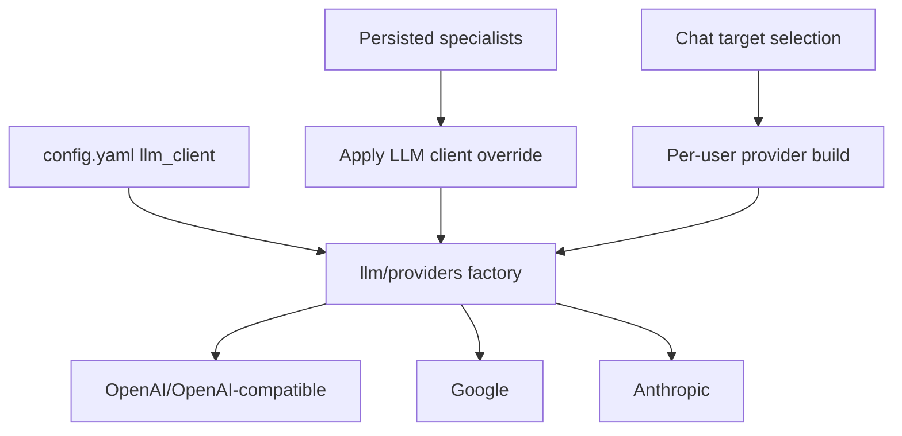

# Component: LLM Providers

Manifold abstracts LLM providers behind `internal/llm.Provider` and provider-specific clients.

## Provider Packages

| Package | Purpose |
| --- | --- |
| `internal/llm/provider.go` | Shared provider interfaces, message/tool types, stream contracts. |
| `internal/llm/providers/factory.go` | Builds configured provider from runtime config. |
| `internal/llm/openai/*` | OpenAI and OpenAI-compatible chat/responses/images/tokenization support. |
| `internal/llm/google/*` | Google provider client and tokenizer. |
| `internal/llm/anthropic/*` | Anthropic provider client and tokenizer. |
| `internal/llm/budget/*` | Token budget helpers. |
| `internal/llm/compaction.go`, `context.go` | Context and compaction utilities. |

## Runtime Provider Selection

## Summary LLM

`agentd` can build a separate summary provider for rolling chat summaries. This lets summarization use a different model or endpoint from the main orchestrator.

## Specialist Overrides

`internal/specialists/orchestrator_config.go` overlays persisted specialist fields onto provider config. It supports provider-specific base URL, API key, model, extra params, extra headers, tools, auto-discovery, and system prompt behavior.

## OpenAI-Compatible Local Models

The README states support for OpenAI-compatible APIs for self-hosted open-weight models. In code, the OpenAI provider path is also used for `local` provider-style configuration.

## Developer Guidance

- Keep provider-specific payload differences inside provider packages.
- Do not leak provider-specific assumptions into `internal/agent` if the shared `llm` interface can express the behavior.
- If adding a provider option, update `config.yaml.example`, settings API types, frontend settings, and tests.
- Token counting and context-window defaults affect summarization and cost; test long-history behavior.

## Evidence

- `go.mod` includes OpenAI-compatible, Anthropic, Google-related dependencies and OTel dependencies.
- `internal/llm/providers/factory.go` builds provider instances.
- `internal/specialists/orchestrator_config.go` applies persisted specialist/provider overrides.
- `internal/agentd/app_init.go` builds main and summary LLM providers.
