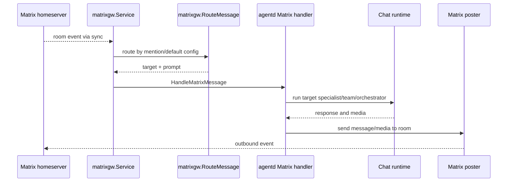
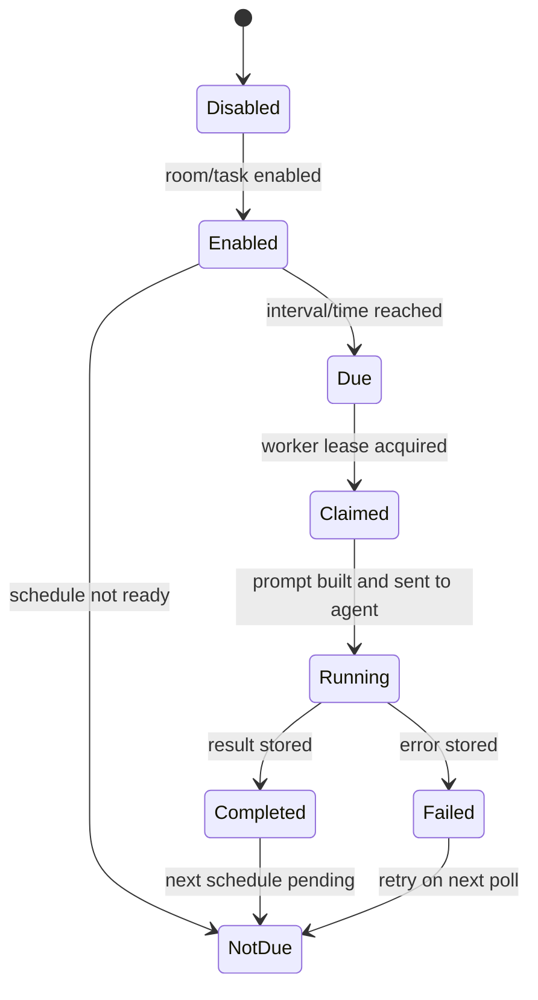

# Component: Matrix Gateway and Pulse

The Matrix gateway routes room messages to Manifold targets. Pulse schedules room-scoped tasks for agents to execute periodically or at specific times.

## Matrix Gateway

`internal/matrixgw` owns Matrix sync lifecycle and message routing:

- validates Matrix config;
- builds room routing tables;
- starts a sync loop;
- deduplicates seen events;
- routes messages by mention/default target;
- posts outbound messages/media.

## Pulse

Pulse evaluates room task schedules and creates prompts for due tasks. Schedule types include interval, daily time, and once-at. Pulse can update room/task state and use `matrix_room_message` when a task requires a room-facing message.

## Project Integration

Matrix rooms can map to project workspaces. Tests in `internal/agentd/matrix_gateway_test.go` cover auto-created room projects and room-scoped chat history.

## Contributor Guidance

- Keep room/task operations tenant and route-target scoped.
- Avoid including full room chat history in Pulse prompts unless deliberately changed.
- Preserve event deduplication and lease/claim behavior to avoid duplicate runs.
- Test mention routing, default routing, room project creation, image/media upload, and Pulse schedule calculations.

## Evidence

- `internal/matrixgw/service.go`, `router.go`, `loop.go`, `poster.go` implement the gateway.
- `internal/agentd/matrix_gateway.go`, `matrix_projects.go`, `handlers_matrix.go` integrate Matrix into `agentd`.
- `internal/pulse/service.go` implements task schedule evaluation and prompt construction.
- `internal/agentd/matrix_pulse.go` connects Pulse to chat execution.
- `docs/matrix-gateway.md` documents setup and runtime behavior.
