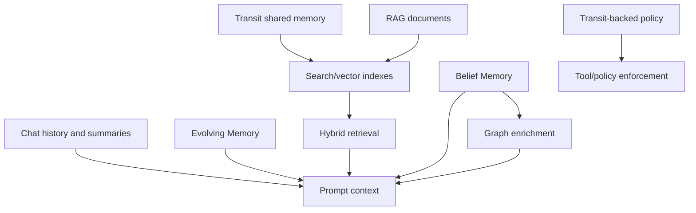
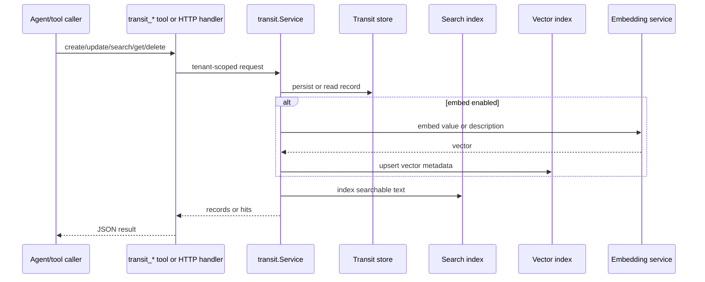
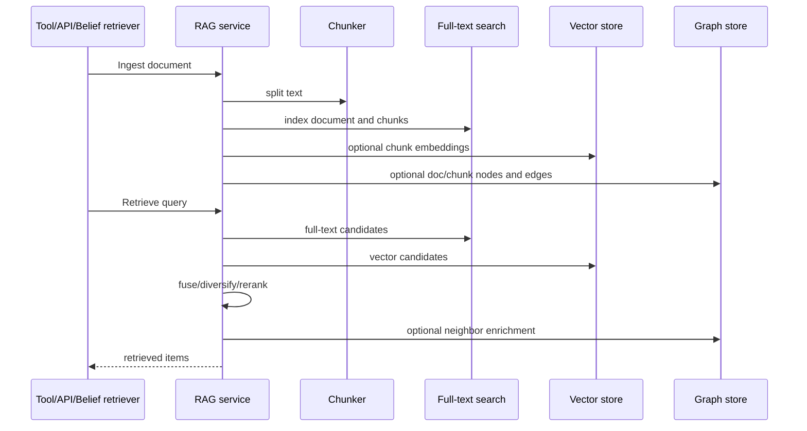

# Component: Memory, RAG, Transit, and Beliefs

Manifold has multiple memory systems. They solve different problems and should not be treated as one shared feature.

## Memory Layers

| Layer | Purpose | Key packages |
| --- | --- | --- |
| Chat memory/summaries | Preserve conversation context within token budget | `internal/agent/memory`, `internal/agentd/chat_handler_setup.go` |
| Evolving memory | Session/user-scoped experience reuse and synthesis | `internal/agent/memory/evolving*.go` |
| Transit | Durable shared key-value memory with optional embeddings/search | `internal/transit`, `internal/tools/transit`, `internal/agentd/handlers_transit.go` |
| RAG | Document ingestion and hybrid retrieval over search/vector/graph stores | `internal/rag/**`, `internal/tools/rag` |
| Belief memory | Probabilistic scoped claims with evidence, episodes, promotion | `internal/agent/belief`, `internal/persistence/databases/belief_store_*` |
| Policy | Runtime policy records, including Transit-backed enforcement | `internal/policy` |

## Transit Flow

## RAG Flow

## Belief Model

Belief memory stores scoped claims, evidence, episodes, and promotion history. Retrieval can be graph-enriched and optionally blended with RAG evidence.

## Contributor Guidance

- Identify the target memory layer before changing code.
- Keep user/tenant scoping explicit.
- Do not inject retrieved content as authoritative instructions; keep it labeled as evidence or context.
- If adding vector use, check configured dimensions and fallback behavior.
- Add tests for create/update/delete/retrieve and tenant isolation.

## Evidence

- `internal/transit/types.go`, `service.go`, `store.go` implement Transit.
- `internal/tools/transit/tools.go` exposes Transit tools.
- `internal/rag/service/service.go` implements ingest/retrieve across search/vector/graph.
- `internal/agent/memory/README.md` describes agent memory concepts.
- `internal/agent/belief/types.go` defines scopes, episodes, beliefs, evidence, promotions, and search queries.
- `internal/agentd/app_init.go` wires Transit, RAG, evolving memory, belief memory, and policy enforcement.
