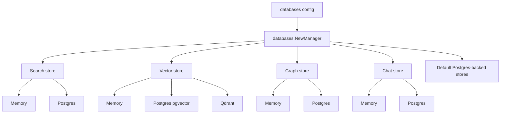

# Component: Persistence

Persistence is built from store interfaces and configurable backends. Some stores fall back to memory when no database is configured; others require a Postgres pool for durable behavior.

## Manager Construction

`internal/persistence/databases/factory.go` constructs a `Manager` with:

- search store;
- vector store;
- graph store;
- chat store;
- specialist activity store;
- Flow v2 store;
- playground store;
- MCP store;
- projects store;
- user preferences store;
- pulse store;
- Matrix message store;
- Transit store;
- belief store;
- evolving memory store when default DSN is available.

## Backend Selection Rules

- Empty or `memory` often selects in-memory implementation.
- `auto` attempts Postgres if a DSN is available, otherwise falls back to memory for supported stores.
- `postgres`/`pg` requires a DSN.
- Vector backend can use Postgres/pgvector or Qdrant.
- `none`/`disabled` selects noop stores for search/vector/graph where supported.

## Embedded Postgres

`internal/embeddedpg` can start a bundled Postgres process. It attempts to install configured extensions such as pgvector, PostGIS, and pgRouting. If pgvector is unavailable in embedded mode, vector storage can fall back to memory while other stores use embedded Postgres.

## Schema Initialization

Many stores initialize their own tables. See [Postgres Schema](../data/postgres-schema.md) for table groups.

## Contributor Guidance

- Add or update store interfaces before handler logic.
- Make memory and Postgres implementations behave equivalently where both exist.
- Add schema migrations when persistent schema changes should be applied outside app initialization.
- Keep table names and indexes documented.
- Test store initialization, tenant scoping, pagination/list ordering, and error mapping.

## Evidence

- `internal/persistence/databases/factory.go` backend construction.
- `internal/embeddedpg/embeddedpg.go`, `extensions.go` embedded Postgres behavior.
- `internal/persistence/databases/*_postgres*.go` schema and queries.
- `deploy/postgres/migrations/*` deploy-time migrations.
