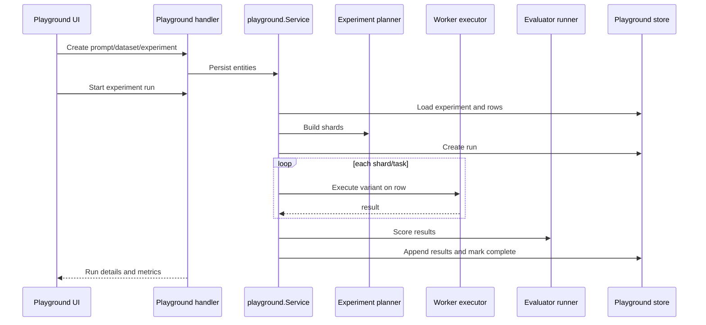

# Component: Playground

The Playground supports prompt, dataset, experiment, and run workflows for evaluating prompt variants.

## Concepts

| Concept | Package | Description |
| --- | --- | --- |
| Prompt registry | `internal/playground/registry` | Prompts and prompt versions. |
| Dataset service | `internal/playground/dataset` | Datasets, snapshots, rows. |
| Experiment repository/planner | `internal/playground/experiment` | Experiment specs, variants, sharding. |
| Worker | `internal/playground/worker` | Executes prompt variant tasks. |
| Evaluators | `internal/playground/eval` | Built-in format and LLM-judge evaluators. |
| API service | `internal/playground/api.go` | Thin orchestration layer over components and store. |
| Store | `internal/persistence/databases/playground_*.go` | Postgres-backed JSONB persistence. |

## Experiment Flow

## Frontend

Playground pages live under `web/agentd-ui/src/views/playground/` and are routed as nested children of `/playground`.

## Contributor Guidance

- Keep prompt/dataset/experiment APIs owner-scoped.
- Be careful with active-run checks; `StartRun` rejects a new run if one is pending or running for the same experiment.
- Add tests for planner sharding, workers, evaluators, and persistence.
- If adding evaluator types, update frontend forms and backend evaluator registry.

## Evidence

- `internal/playground/api.go` wires service methods.
- `internal/playground/experiment/spec.go` defines experiment specs, variants, concurrency, shards, and planner.
- `internal/playground/eval/eval.go` registers `format` and `llm-judge` evaluators.
- `internal/persistence/databases/playground_store.go` initializes playground tables.
- `web/agentd-ui/src/views/playground/*` and `src/api/playground.ts` implement UI integration.
