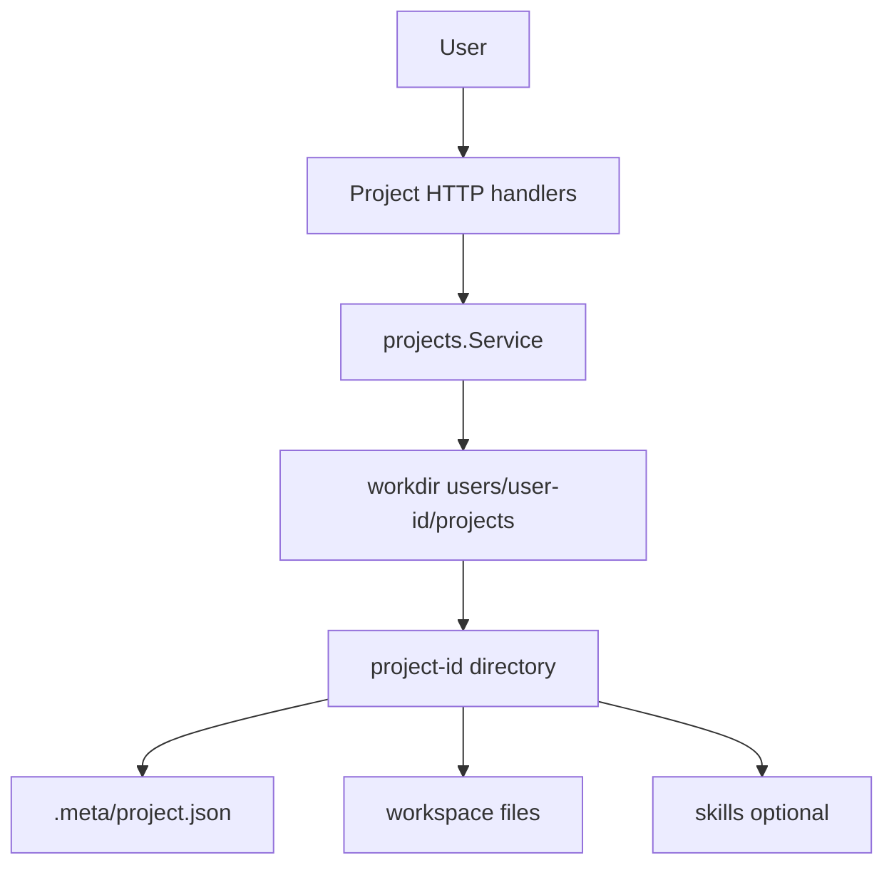

# Component: Projects and Workspaces

Projects are per-user filesystem workspaces. They are central to safe tool execution: file tools, CLI tools, MCP servers, and workflows should operate inside the active project root.

## Project Service

`internal/projects/service.go` provides:

- project creation and metadata;
- project kind normalization (`chat`, `matrix`);
- per-user project listing;
- file tree listing;
- file read/write/upload/delete/move;
- project archive streaming support;
- generation counters for project and skills changes;
- optional seeding of default skills into `skills`.

## Workspace Manager

`internal/workspaces/manager.go` resolves a project ID to a workspace path and hands that path to runtime code. The workspace manager's mode is currently local filesystem.

## Path Safety

Path safety appears in several layers:

- `projects.Service` validates project IDs and resolves paths under the user project root.
- `sandbox.SanitizeArg` and related path policy code prevent traversal and unsafe path forms.
- File tools guard allowed roots and reject symlink/directory misuse where relevant.
- CLI executor is configured with a workdir and command limits.
- Path-dependent MCP servers use `{{PROJECT_DIR}}` substitution and per-user lifecycle when needed.

## Project-Local Skills

Agents load project skills from `skills` inside the active project root. They can also discover universal read-only skills from `$HOME/.manifold/skills` and `$HOME/.agents/skills` through dedicated skill tools, while normal file tools stay project-scoped.

## Contributor Guidance

- Treat project IDs and file paths as untrusted input.
- Do not join paths manually in handlers when a service helper exists.
- Be careful when adding archive, move, upload, or recursive delete behavior.
- Add tests for traversal attempts, symlinks, empty paths, and missing projects.
- If changing project metadata, consider both filesystem `.meta/project.json` and any DB project store behavior.

## Evidence

- `internal/projects/service.go` implements filesystem-backed projects.
- `internal/workspaces/manager.go` implements local workspace checkout/resolution.
- `internal/sandbox/pathpolicy.go` and `internal/sandbox/workdir.go` define path policies.
- `internal/tools/filetool/tool.go` implements guarded file tools.
- `README.md`, `QUICKSTART.md`, and `docs/storage.md` describe project-local skills and project storage.
