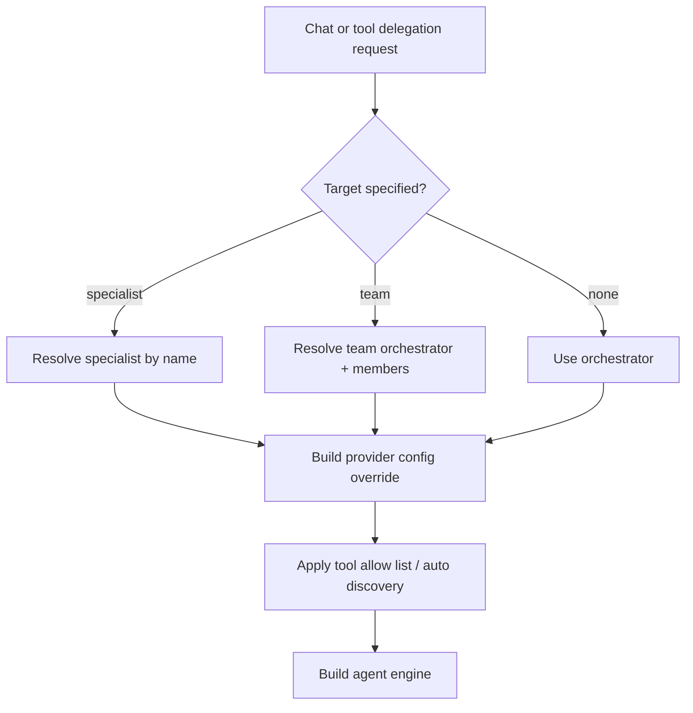

# Component: Specialists and Teams

Specialists are named model configurations with optional system prompts and tool policies. Teams group specialists behind an orchestrator-style route.

## Concepts

| Concept | Purpose | Evidence |
| --- | --- | --- |
| Specialist registry | Resolve named agents and build provider-specific clients | `internal/specialists/registry.go` |
| Orchestrator config | Persisted orchestrator specialist can override main runtime provider/tools/system prompt | `internal/specialists/orchestrator_config.go` |
| Routing | Match text to specialist routes by contains/regex | `internal/specialists/router.go` |
| Specialist API | CRUD and defaults endpoints | `internal/agentd/handlers_specialists.go` |
| Teams API | Team composition and members | `internal/agentd/handlers_teams.go`, `internal/agentd/specialist_team_ops.go` |
| Delegation tools | Agent-visible specialist/team calls | `internal/tools/agents/*` |

## Runtime Resolution

## Tool Policy Per Specialist

A specialist can disable tools, allow only selected tools, or use auto-discovery. This means two requests with the same prompt can have different tool surfaces depending on target specialist/team.

## Orchestrator Defaults

If no persisted orchestrator exists, the code has a default orchestrator prompt. If a persisted orchestrator exists, it can override the runtime config's provider, model, tool enablement, tool allow list, auto-discovery, and system prompt.

## Contributor Guidance

- Test direct specialist, orchestrator fallback, and team paths separately.
- Be careful with per-user specialist registries when auth is enabled.
- Keep provider-specific overrides centralized in `specialists/orchestrator_config.go`.
- Keep UI types, API handlers, and persistence stores aligned when adding fields.

## Evidence

- `internal/specialists/registry.go` and tests build specialists from config/store.
- `internal/specialists/orchestrator_config.go` overlays persisted specialist settings.
- `internal/specialists/router.go` implements route matching.
- `internal/agentd/chat_engine_builders.go` applies specialist/team tool and prompt configuration.
- `internal/tools/agents/ask_agent.go`, `delegate_to_team.go`, and `agent_call.go` expose delegation.
