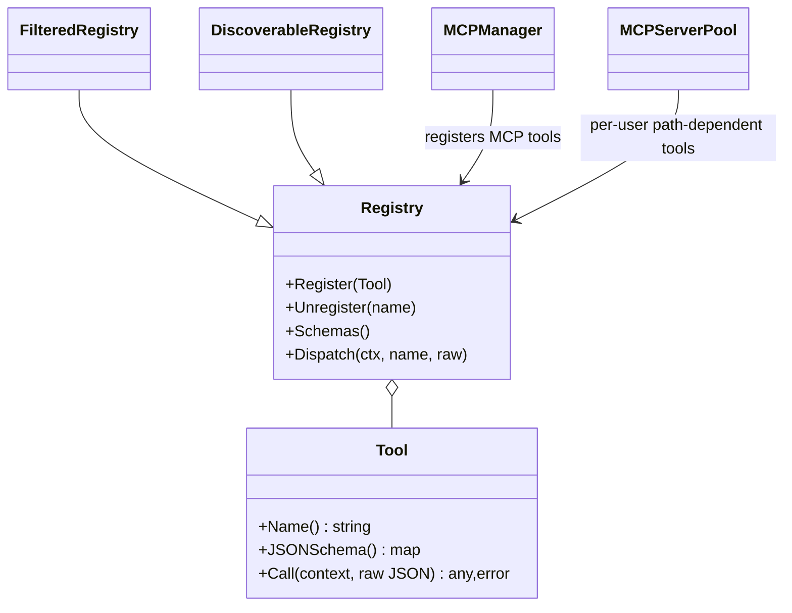
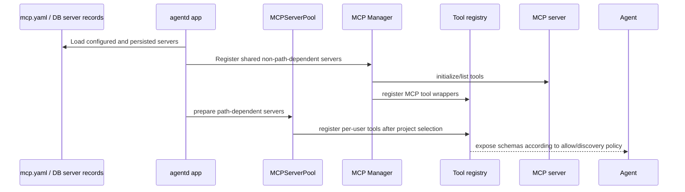

# Component: Tools and MCP

Tools are executable capabilities exposed to the agent through JSON schemas. MCP servers add external tools to the same registry model.

## Tool Registry Model

## Built-In Tools Registered by `agentd`

`internal/agentd/app_init.go` registers these categories:

| Category | Tool names / prefix | Package |
| --- | --- | --- |
| CLI | `run_cli` | `internal/tools/cli` |
| Terminal sessions | `terminal_start`, `terminal_read`, `terminal_write`, `terminal_stop`, `terminal_list` | `internal/tools/terminal` |
| Web | `web_fetch`, `web_screenshot` | `internal/tools/web` |
| Patch/file | `apply_patch`, `file_read`, `file_write`, `file_patch`, `file_delete` | `internal/tools/patchtool`, `internal/tools/filetool` |
| Text utilities | `split_text`, `utility_textbox`, `agent_response` | `internal/tools/textsplitter`, `internal/tools/utility` |
| Matrix/Pulse | `matrix_room_message`, `pulse_tasks` | `internal/tools/matrixroom`, `internal/tools/pulse` |
| Parallel/tool orchestration | `llm_parallel_completions`, `multi_tool_use_parallel` | `internal/tools/llmparallel`, `internal/tools/multitool` |
| Voice/image | `text_to_speech`, `describe_image` | `internal/tools/tts`, `internal/tools/imagetool` |
| RAG | `rag_ingest`, `rag_retrieve` | `internal/tools/rag` |
| Code evolution/QA | `code_evolve`, `code_qa_judge`, `code_qa_run`, `code_qa_optimize` | `internal/tools/codeevolve`, `internal/tools/codeqa` |
| Transit | `transit_create`, `transit_get`, `transit_update`, `transit_delete`, `transit_search`, `transit_discover`, `transit_list_keys`, `transit_list_recent` | `internal/tools/transit` |
| Delegation | `agent_call`, `ask_agent`, `delegate_to_team` | `internal/tools/agents` |
| Discovery | `tool_search` | `internal/tools/discovery` |
| Saved workflows | `warpp_*` | `internal/tools/warpptool` |

## Tool Exposure Controls

Manifold can limit tool exposure at multiple levels:

- global `enableTools`;
- global `allowTools`;
- `autoDiscover` and `maxDiscoveredTools`;
- specialist-specific tool enablement and allow lists;
- team/orchestrator inherited configuration;
- MCP server enablement and persisted server state.

## MCP Lifecycle

## Path-Dependent MCP Servers

`mcp.yaml.example` uses `{{PROJECT_DIR}}` placeholders for servers that need the active project root. `MCPServerPool` handles per-user sessions when auth is enabled and path-dependent servers cannot safely be shared globally.

## Contributor Guidance

- Tool schema descriptions affect model behavior; write them like API contracts.
- Tool handlers should validate inputs and return structured errors.
- Do not expose filesystem or command execution without sandboxing.
- Add tests for JSON schema, dispatch, and failure modes.
- If adding a tool, update [Tool Catalog](../interfaces/tools.md) and consider auto-discovery search metadata.

## Evidence

- `internal/tools/types.go`, `internal/tools/registry*.go` define core interfaces and dispatch.
- `internal/agentd/app_init.go` lists registered built-in tools.
- `internal/tools/discovery/*` implements tool search/discoverable registries.
- `internal/mcpclient/mcpclient.go`, `internal/mcpclient/pool.go`, and `internal/agentd/handlers_mcp.go` implement MCP registration and lifecycle.
- `mcp.yaml.example` documents local and remote MCP server config.
