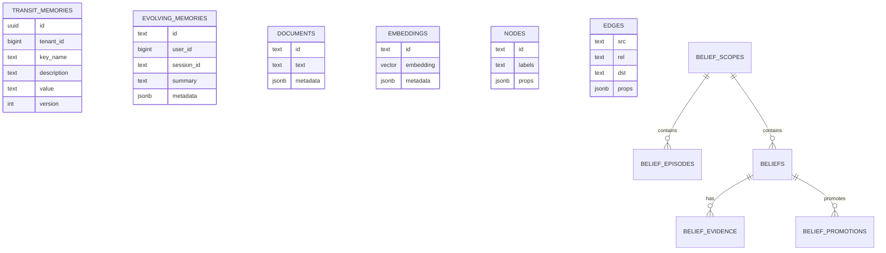

# Data: Memory Systems

This page maps memory-related persistence and retrieval structures.

## Memory Entity Map

## Transit Fields

Transit records include key, description, value, base64 flag, embed flag, embed source, version, tenant/user audit fields, and timestamps.

## Belief Fields

Beliefs include statement, statement hash, confidence, evidence counts, status, optional expiry, embedding vector, and metadata. Evidence records link to episodes or external sources and record polarity/weight.

## Retrieval Paths

- Transit search can combine store/search/vector results depending on config.
- RAG retrieval fuses full-text and vector candidates, then optionally uses graph and reranking.
- Belief retrieval searches scoped beliefs and can blend RAG evidence into prompt context.
- Evolving memory retrieves and updates session-scoped experience entries.

## Evidence

- `internal/transit/types.go`.
- `internal/rag/service/service.go`.
- `internal/agent/belief/types.go`.
- `internal/persistence/databases/transit_store_postgres.go`, `evolving_memory_schema_postgres.go`, `belief_store_postgres.go`, `postgres_search.go`, `postgres_vector.go`, `postgres_graph.go`.
