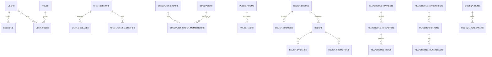

# Data: Postgres Schema

This page summarizes tables created by application store initialization and migrations. It is a map, not a complete SQL reference.

## Schema Groups

| Group | Tables |
| --- | --- |
| Auth | `users`, `roles`, `user_roles`, `sessions` |
| Chat | `chat_sessions`, `chat_messages`, `chat_agent_activities` |
| Projects | `projects`, `project_files` |
| Specialists/teams | `specialists`, `specialist_groups`, `specialist_group_memberships` |
| MCP | `mcp_servers` |
| Preferences | `user_preferences` |
| Flow v2 | `flow_v2_workflows` |
| Pulse/Matrix | `pulse_rooms`, `pulse_tasks`, `matrix_messages` |
| Transit | `transit_memories` |
| Evolving memory | `evolving_memories` |
| Belief memory | `belief_scopes`, `belief_episodes`, `beliefs`, `belief_evidence`, `belief_promotions` |
| Search/vector/graph | `documents`, `embeddings`, `nodes`, `edges` |
| Playground | `playground_prompts`, `playground_prompt_versions`, `playground_datasets`, `playground_snapshots`, `playground_rows`, `playground_experiments`, `playground_runs`, `playground_run_results` |
| CodeQA | `codeqa_runs`, `codeqa_run_events` |
| Policy/reactive claims | `reactive_claims` |

## ER Overview

## Schema Change Checklist

- Update application `Init` SQL.
- Add or update deploy migration when appropriate.
- Update store tests and tenant/user scoping tests.
- Update this page and [Evidence](../evidence.md).
- Check OpenAPI and frontend types if the schema affects API payloads.

## Evidence

- SQL extraction from `internal/persistence/databases/*_postgres*.go`.
- `internal/auth/store.go` auth schema.
- `internal/codeqa/store/postgres.go` CodeQA schema.
- `deploy/postgres/migrations/*` migration files.
