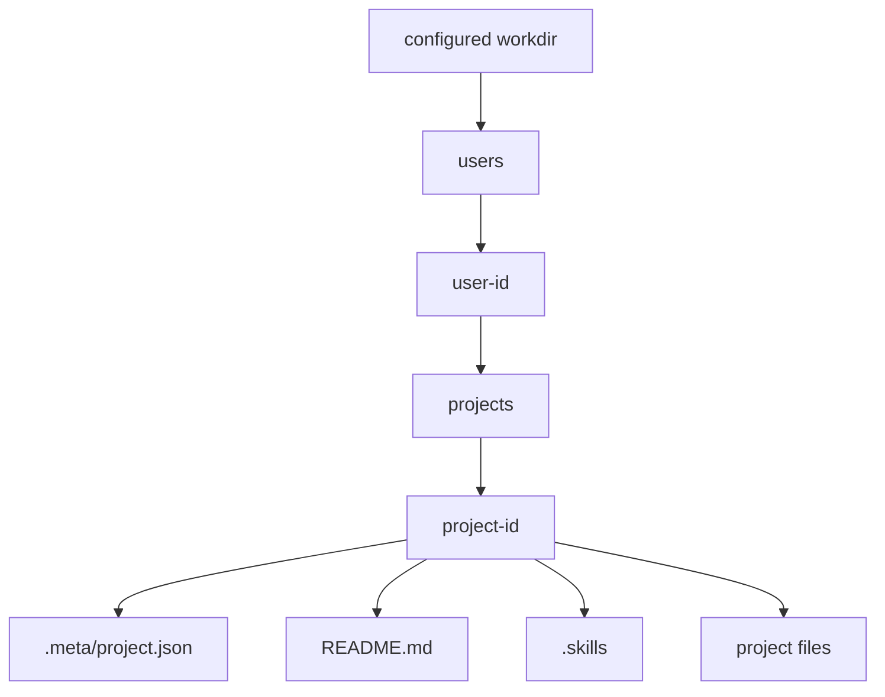

# Data: Storage Model

Manifold combines filesystem project storage with optional database-backed metadata, chat, memory, and operational state.

## Filesystem Projects

Projects live under the configured `workdir`, grouped by user ID and project ID. Each project has metadata at `.meta/project.json` and may have a `.skills` folder.

## Database State

Depending on configuration, Postgres may store:

- auth users, roles, sessions;
- chat sessions/messages/activities;
- projects metadata/index entries;
- specialists and teams;
- MCP server records;
- Flow v2 workflows and run events;
- Matrix messages and Pulse tasks;
- Transit records;
- evolving memories;
- belief memory entities;
- playground prompts/datasets/experiments/runs;
- CodeQA runs/events;
- search/vector/graph records;
- observability data when ClickHouse is enabled for telemetry.

## Embedded Postgres vs External Postgres

External Postgres is the compose default path. Embedded Postgres is a host-run option. The same store interfaces should work regardless of where the DSN came from.

## Backups

A recoverable local deployment should back up:

- configured database state;
- embedded Postgres data if embedded mode is used;
- the entire configured workdir.

## Evidence

- `docs/storage.md`, `docs/deployment.md`.
- `internal/projects/service.go` filesystem project logic.
- `internal/persistence/databases/factory.go` store construction.
- `internal/embeddedpg/*` embedded Postgres runtime.
