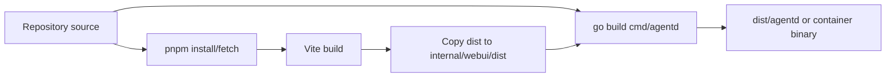

# Build and Run

## Docker Compose

The recommended first-run deployment uses Compose services:

```bash
docker compose up -d pg-manifold manifold
```

Optional services include ClickHouse, OpenTelemetry Collector, Keycloak, and Keycloak DB.

## Host Backend Builds

```bash
make build-agentd
make build-agent
make build-manifold
make build-manifold-beta
```

- `build-agentd` builds the server binary.
- `build-agent` builds the standalone CLI agent.
- `build-manifold` builds the frontend and embeds it into `agentd`.
- `build-manifold-beta` enables beta UI links during frontend build.

## Frontend Builds

```bash
pnpm -C web/agentd-ui build
make frontend
```

`make frontend` builds and copies frontend assets to the Go embed directory.

## OpenAPI Generation

```bash
make openapi
```

This runs `cmd/openapi` and writes `docs/openapi/openapi.json`.

## Self-Contained Host Run

Manifold can run with embedded Postgres and local observability buffers. Configure database DSNs empty and enable embedded DB in `config.yaml`, then build and run `dist/agentd`.

## Build Pipeline



## Evidence

- `Makefile` targets.
- `web/agentd-ui/package.json` scripts.
- `deploy/docker/cpu.Dockerfile` multi-stage UI/backend build.
- `cmd/openapi/main.go` and `docs/openapi.md`.
