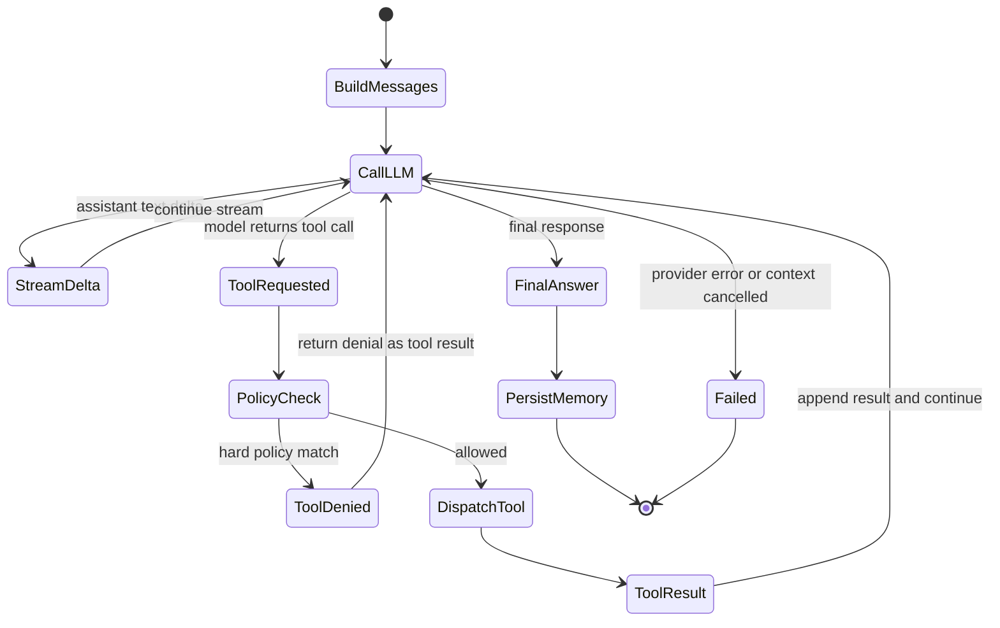

# Runtime Flow: Agent Tool Loop

This flow explains how an agent uses tools during a reasoning run.

## State Machine

## Tool Dispatch Rules

- The model sees only schemas exposed by the current registry.
- `enableTools`, `allowTools`, specialist overrides, and auto-discovery affect visible schemas.
- Tool dispatch uses normalized tool names and returns JSON bytes.
- `multi_tool_use_parallel` can dispatch multiple allowed tools concurrently, respecting configured max parallelism.
- Policies can block or annotate tool use when belief/policy memory is enabled.

## Delegation as Tools

`agent_call`, `ask_agent`, and `delegate_to_team` appear as tools, but they recursively run other agents or team orchestrators. Their traces are emitted so the UI can render nested agent activity.

## Evidence

- `internal/agent/engine_loop.go`, `engine_tools.go`, `engine_run.go`, `engine_stream.go`.
- `internal/tools/types.go`, `internal/tools/registry*.go`, `internal/tools/multitool/parallel.go`.
- `internal/tools/agents/*` for delegation tools.
- `internal/policy/*` for policy decisions.
