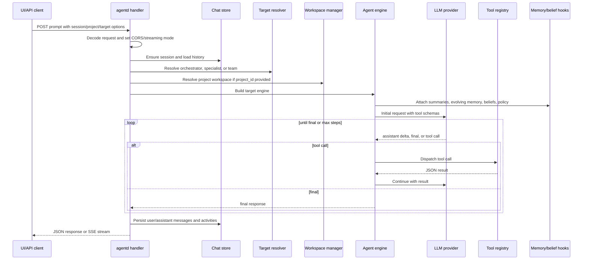

# Runtime Flow: Chat Request

This flow covers `/api/prompt` and `/agent/run`, the primary paths for model-driven work.

## Sequence

## Key Decisions in the Flow

| Decision | Where | Notes |
| --- | --- | --- |
| Streaming vs JSON | `chat_transport.go`, `chat_execution.go` | Stream clients receive server-sent events. |
| Target | `chat_target_dispatch.go`, `chat_engine_builders.go` | Orchestrator, specialist, or team. |
| Project context | `chat_handler_setup.go`, `workspaces.Manager` | Project ID scopes tools and MCP. |
| History and summary | `chat_handler_setup.go`, `agent/messages.go` | Prior messages are marked as history; summaries may be inserted. |
| Tool surface | `chat_engine_builders.go`, `tools.ApplyTopLevelPolicy`, discovery registry | Depends on config and specialist/team settings. |
| Memory | `evolving_sessions.go`, `configureBeliefRunState` | Optional evolving memory, ReMem, beliefs, RAG evidence, policy. |

## Error and Timeout Behavior

- Global agent run timeout may be configured.
- Streaming timeouts are separate from non-streaming runs.
- Tool errors are usually returned as structured data to the model.
- Auth failures should return unauthorized when auth is enabled.
- Workspace/project resolution failures should not fall back to unsafe default paths.

## Contributor Tests to Check

- `internal/agentd/handlers_chat_test.go`
- `internal/agentd/handlers_agent_run_test.go`
- `internal/agentd/chat_execution_test.go`
- `internal/agentd/chat_transport_test.go`
- `internal/agentd/chat_target_dispatch_test.go`
- `internal/agentd/chat_handler_setup_test.go`
- `internal/agent/*_test.go`

## Evidence

- `internal/agentd/handlers_chat.go` defines chat session, prompt, and agent run handlers.
- `internal/agentd/chat_execution.go` handles stream and JSON execution.
- `internal/agentd/chat_target_dispatch.go` selects target runtime.
- `internal/agentd/chat_engine_builders.go` builds engines for orchestrator, specialists, and teams.
- `internal/agent/messages.go` builds initial messages with history/current request markers.
