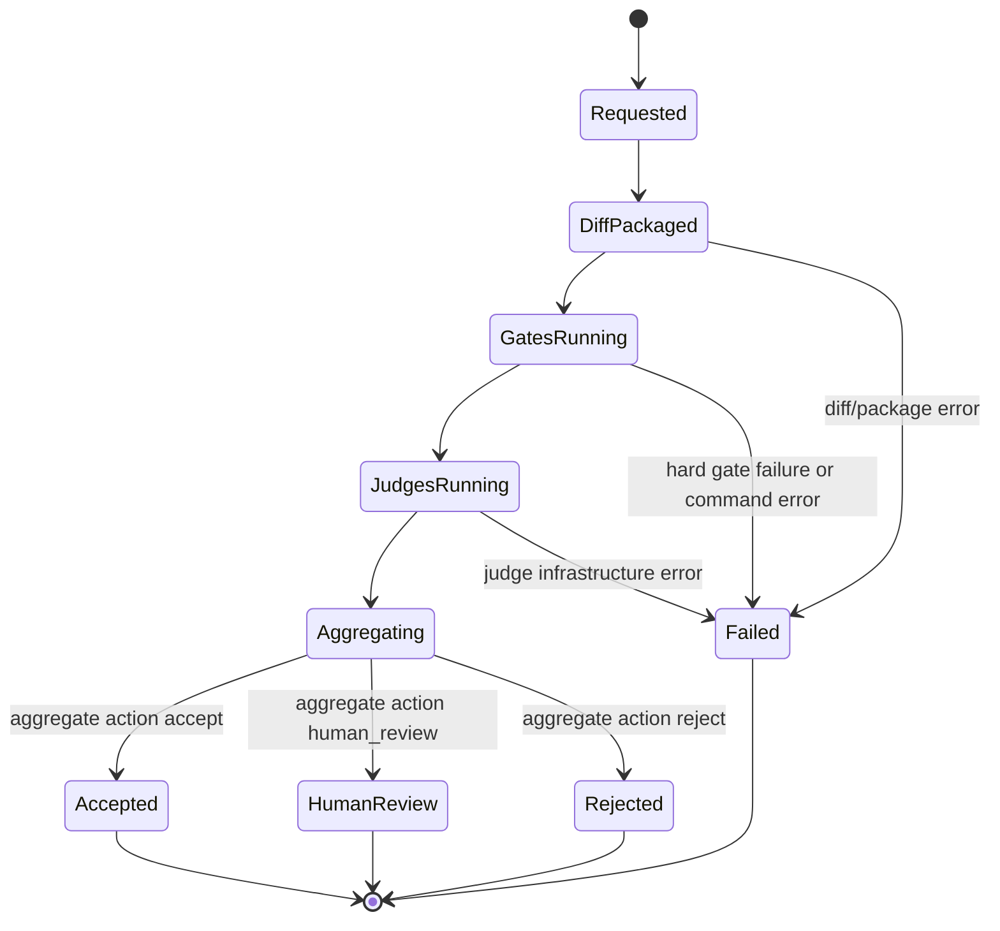
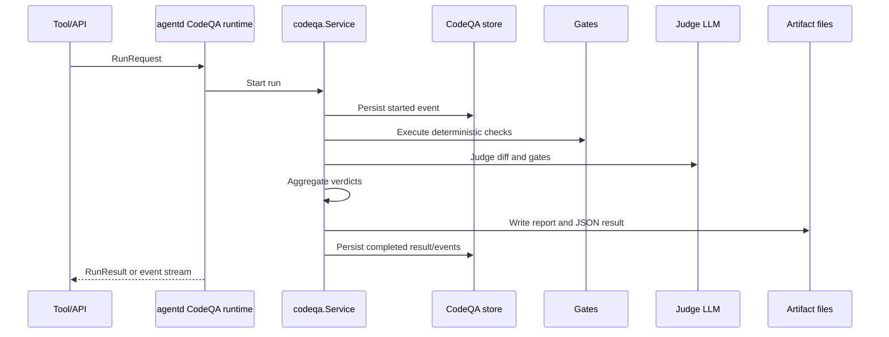

# Runtime Flow: Code QA Run

CodeQA runs can be created through HTTP or agent tools. The service packages a diff, runs gates, asks judges, aggregates results, and writes artifacts/events.

## State Diagram

## Sequence

## Evidence

- `internal/codeqa/types.go`, `config.go`, `service/run.go`, `service/report.go`.
- `internal/codeqa/gates/*`, `internal/codeqa/judge/*`, `internal/codeqa/diff/*`.
- `internal/codeqa/store/postgres.go` creates `codeqa_runs` and `codeqa_run_events`.
- `internal/agentd/handlers_codeqa.go` exposes run and event endpoints.
- `internal/tools/codeqa/tool.go` exposes agent tools.
