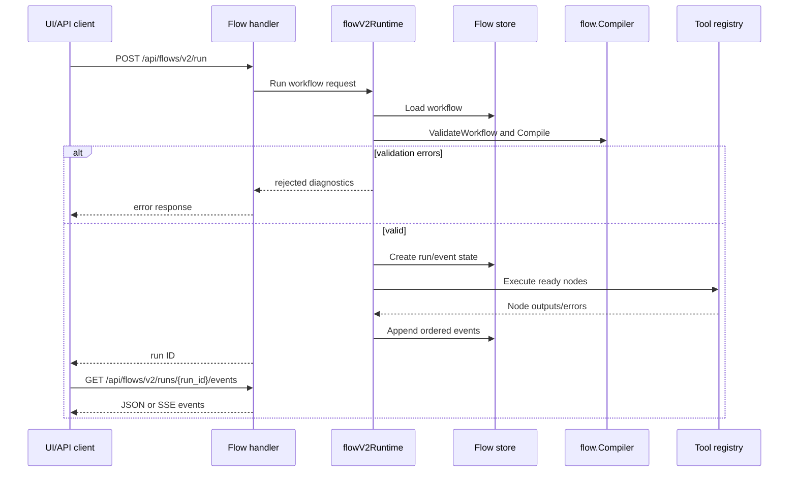

# Runtime Flow: Flow v2 Run

Flow v2 run execution turns a saved workflow definition into ordered node events and outputs.

## Sequence

## Event Types to Preserve

The frontend depends on run and node lifecycle events. Preserve event names and ordering unless coordinating frontend changes.

## Validation Before Execution

The compiler should catch invalid workflow IDs, missing names, invalid trigger types, duplicate nodes, invalid node kinds, invalid retries/backoff, missing edge endpoints, and cycles.

## Evidence

- `internal/flow/types.go`, `internal/flow/compiler.go`.
- `internal/agentd/handlers_flow_v2.go`.
- `internal/agentd/flow_v2_runtime.go`.
- `internal/agentd/flow_v2_runtime_test.go` and `internal/flow/compiler_test.go`.
