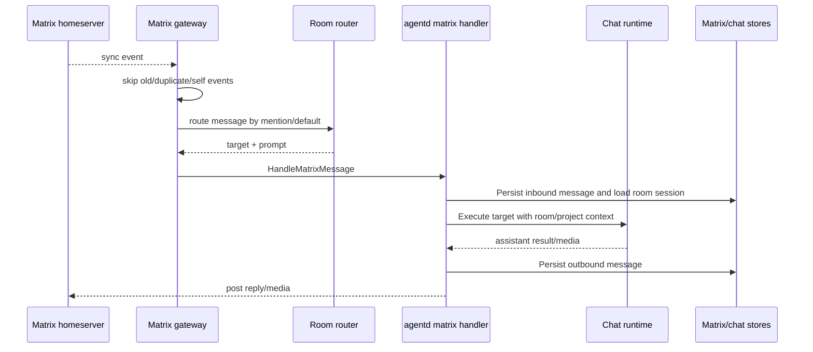
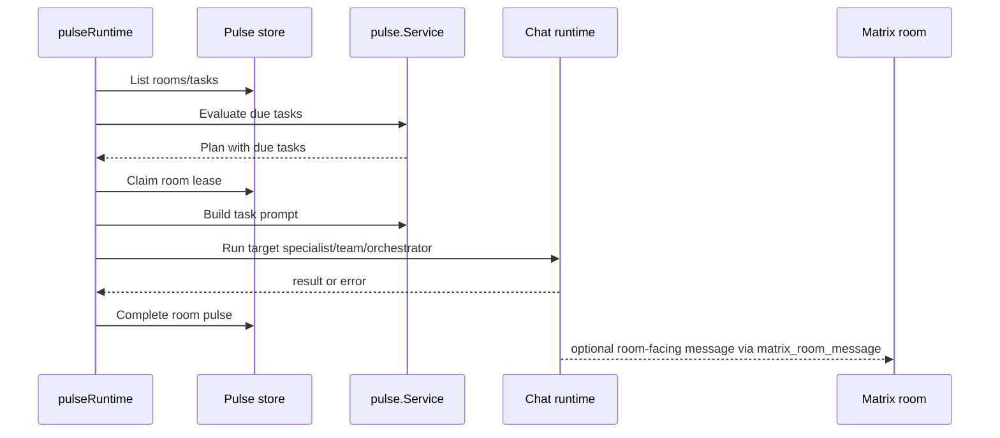

# Runtime Flow: Matrix and Pulse

This flow combines inbound Matrix messages and scheduled Pulse tasks.

## Matrix Message Flow

## Pulse Task Flow

## Evidence

- `internal/matrixgw/loop.go`, `router.go`, `service.go`, `poster.go`.
- `internal/agentd/matrix_gateway.go`, `matrix_projects.go`, `matrix_pulse.go`.
- `internal/pulse/service.go`.
- `internal/persistence/databases/pulse_store_postgres.go`, `matrix_message_store_postgres.go`.
