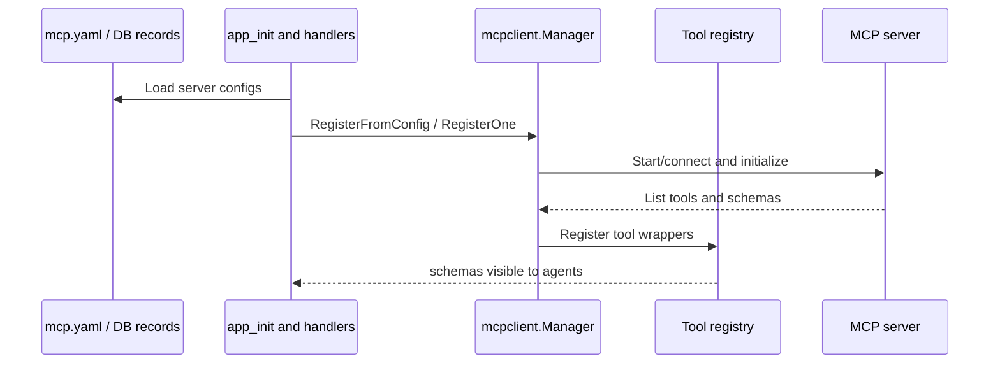
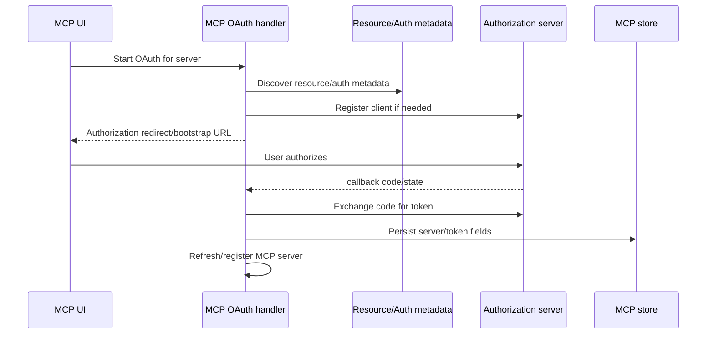
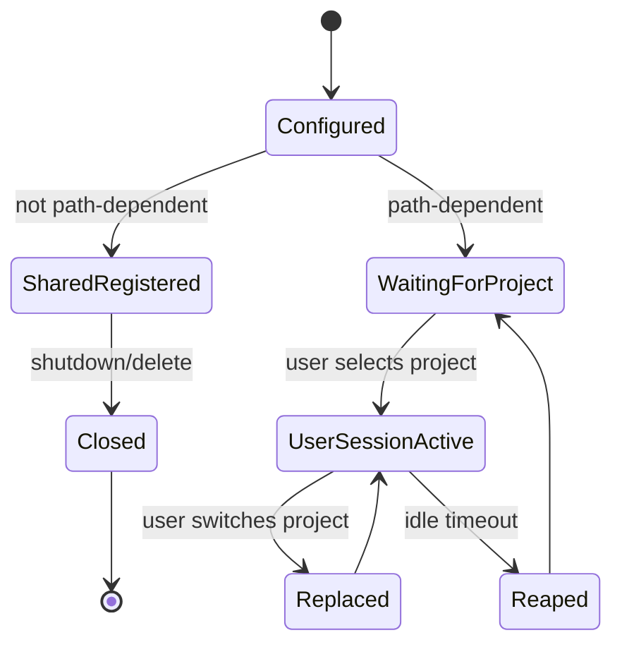

# Runtime Flow: MCP Lifecycle

MCP servers can be configured in YAML or persisted through the API. They register tools into the Manifold tool registry.

## Server Registration Flow

## OAuth Flow

## Path-Dependent Server State

## Evidence

- `mcp.yaml.example` documents server fields.
- `internal/mcpclient/mcpclient.go` registers configured servers.
- `internal/mcpclient/pool.go` manages path-dependent per-user sessions.
- `internal/agentd/handlers_mcp.go` implements CRUD and OAuth handlers.
- `docs/mcp.md` describes MCP configuration and usage.
