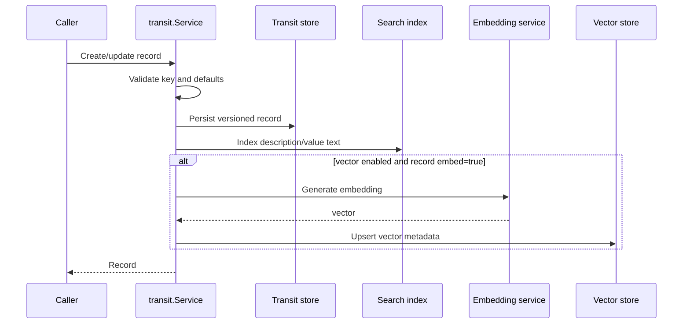
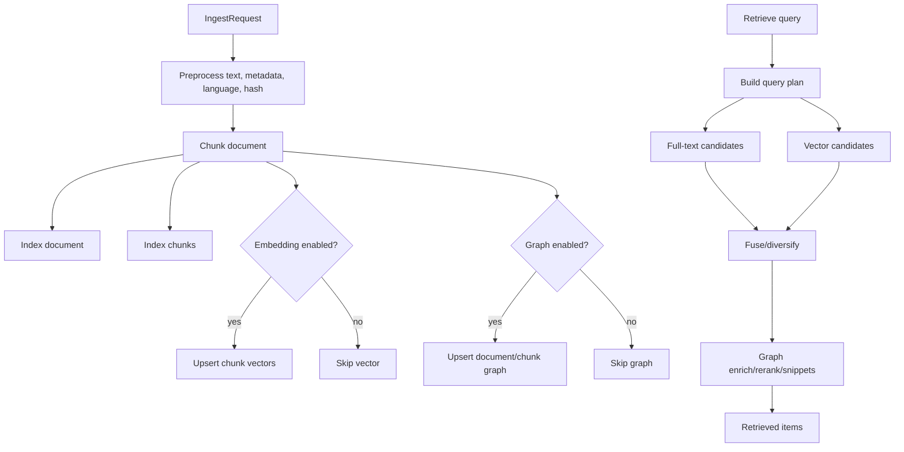

# Runtime Flow: Memory Ingest and Retrieval

This page focuses on document/memory indexing flows, not chat summarization.

## Transit Record Flow

## RAG Ingest/Retrieve Flow

## Evidence

- `internal/transit/service.go` validates, stores, indexes, and searches Transit records.
- `internal/rag/service/service.go` implements ingestion and retrieval stages.
- `internal/rag/ingest/*`, `internal/rag/retrieve/*`, `internal/rag/chunker/*`, `internal/rag/embedder/*` support the service.
- `internal/tools/rag/tool.go` and `internal/tools/transit/tools.go` expose agent tools.
