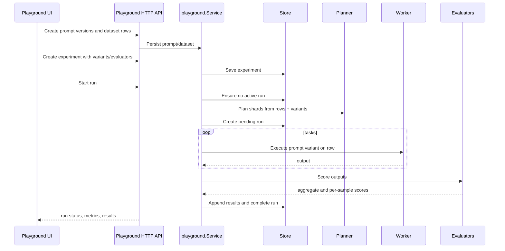

# Runtime Flow: Playground Experiment

The Playground lets developers compare prompt variants over datasets and evaluators.

## Sequence

## Evidence

- `internal/playground/api.go` service orchestration.
- `internal/playground/experiment/spec.go` planner and experiment types.
- `internal/playground/worker/worker.go` task execution abstractions.
- `internal/playground/eval/eval.go` evaluator registry and runner.
- `internal/persistence/databases/playground_store.go` tables.
- `web/agentd-ui/src/views/playground/*` UI pages.
