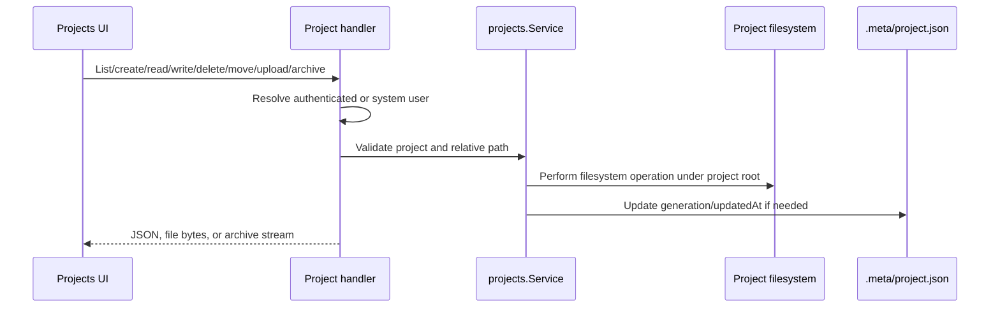
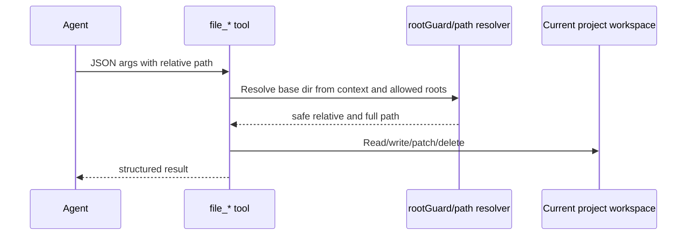

# Runtime Flow: Project File Operations

Project file operations appear through HTTP project APIs and agent file tools. Both must preserve workspace containment.

## HTTP Project Operations

## Agent File Tool Operations

## Safety Invariants

- Project IDs must validate.
- Paths must resolve under project root/current workspace root.
- Symlinks require careful handling; file tools reject symlink operations in dangerous paths.
- Recursive deletion requires explicit intent.
- Archive and upload paths must not escape the project.

## Evidence

- `internal/projects/service.go` implements filesystem project operations.
- `internal/agentd/handlers_projects.go` exposes HTTP operations.
- `internal/workspaces/manager.go` resolves workspaces.
- `internal/sandbox/pathpolicy.go` and `internal/tools/filetool/tool.go` enforce path constraints.
