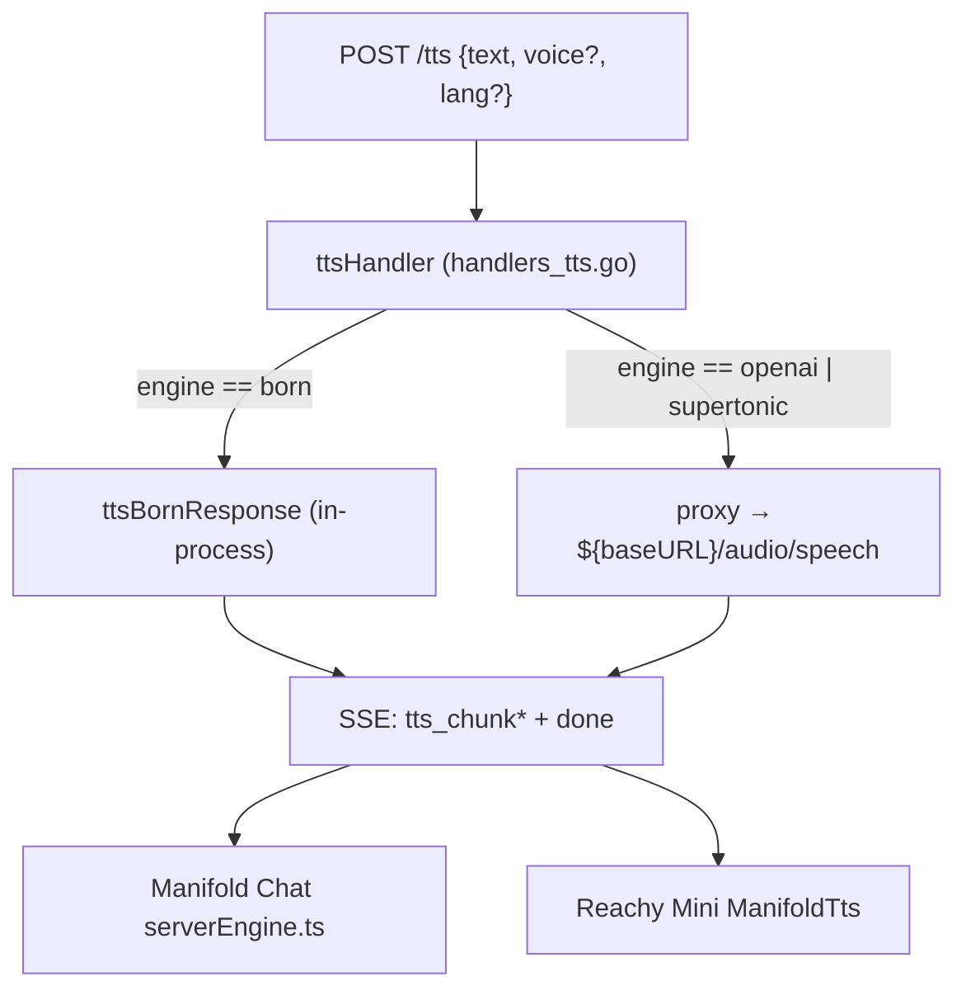
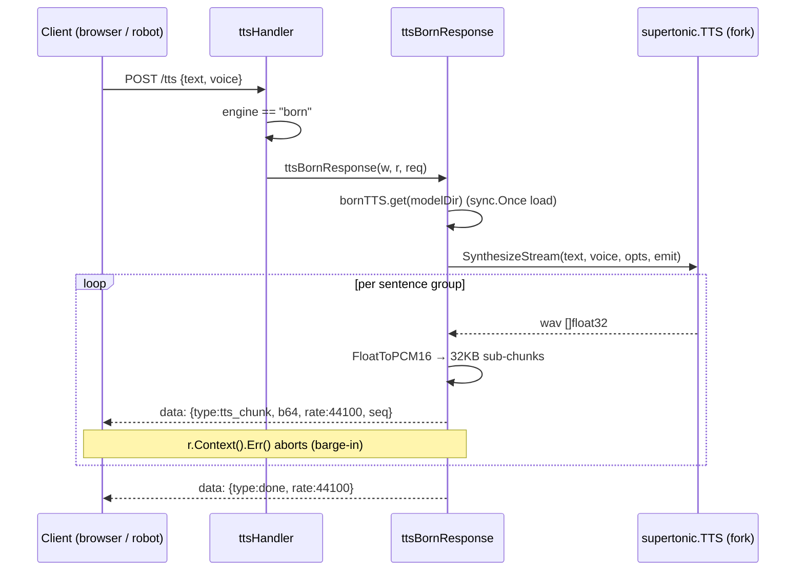
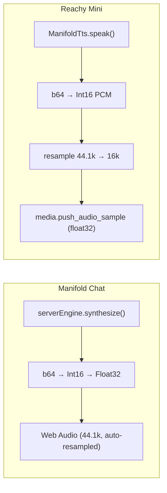

# Flow: `/tts` Request → Streamed Audio

## Purpose

Show how a text-to-speech request moves through the `/tts` route to a streamed
`tts_chunk` response, for each engine, and how the two consumers (Manifold Chat,
the Reachy Mini bot) play it. Related: [TTS component](../components/tts.md).

## Dispatch

Evidence: `internal/agentd/handlers_tts.go` (engine branch), `handlers_tts_born.go`
(born path), `router.go` (`/tts` registration).

## In-process `born` sequence

`bornTTSHolder` caches the loaded engine (and any load error) so only the first
request pays the ~4-graph ONNX load. Evidence: `handlers_tts_born.go`.

## Consumer playback

- **Browser** (`serverEngine.ts`): buffers `tts_chunk` frames into one
  `Float32Array` per synthesized chunk and hands it to the existing
  `SupertonicStreamer` playback (Web Audio resamples 44.1 kHz to the context rate).
- **Robot** (separate repo, `speech.py` `ManifoldTts`): decodes PCM16, resamples
  44.1 kHz → the Reachy speaker's 16 kHz, and pushes float32 frames. Streaming per
  sentence group keeps time-to-first-audio low.

## Errors and edge cases

- `engine: born` but no `modelDir` → `503` before any frame.
- Engine load failure (bad model dir) → `503` (cached; not retried per request).
- Mid-stream synthesis error → in-band `{"type":"error"}` frame, `done` withheld,
  so a truncated stream is not mistaken for success.
- Empty `text` → empty stream (no `tts_chunk`).
- Client disconnect → synthesis stops (checked each emitted group).

Evidence: `handlers_tts_born.go` (status codes, error frame, context check);
`web/agentd-ui/src/lib/tts/supertonic/serverEngine.ts` (client-side empty/HTTP-error
handling).
