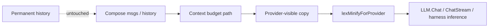

# Manifold Software Wiki

Manifold is a Go agent platform: orchestration, tools, memory, and multi-provider LLM calls. Documented paths: the **lexminify** provider-compression path, and the **text-to-speech (`/tts`)** path with a pure-Go in-process Supertonic engine.

## Start Here (TTS)

| Page | Why |
| --- | --- |
| [TTS component (`/tts`)](components/tts.md) | Three engines behind one route; SSE contract; the `born` pure-Go engine; frontend swap off WebGPU |
| [TTS request flow](flows/tts-path.md) | Dispatch, in-process `born` sequence, browser + robot playback, errors |
| [Evidence](evidence.md) | File/symbol provenance (TTS section) |

## Start Here (lexminify)

| Page | Why |
| --- | --- |
| [lexminify package](components/lexminify.md) | Levels, zones (incl. tool default-on), protection, API |
| [Provider minify flow](flows/lexminify-provider-path.md) | Where hooks run; permanent history never mutated |
| [Architecture decisions](architecture/decisions.md) | Default level 6, system + tool zones on, rejected caps |
| [Evidence](evidence.md) | File/symbol provenance |
| [Testing notes](development/testing.md) | Focused `go test` packages |

## Repository Snapshot

| Area | Current Understanding | Evidence |
| --- | --- | --- |
| Primary language | Go modules under `manifold/` | `go.mod` |
| Agent core | `internal/agent` engine loop + harness | `engine.go`, `engine_loop.go`, `engine_harness.go` |
| Lexical minification | Pure Go package `internal/llm/lexminify` | `lexminify.go`, `protect.go`, `tables.go` |
| Default product level | `agent.DefaultLexMinifyLevel = 6` (`L5Aggressive`) | `engine.go` |
| Default zones | Runtime + history + **tool** + assistant + system prompt; **not** current-request body | `DefaultZones` in `lexminify.go` |
| Wire points | `lexMinifyForProvider` before `LLM.Chat` / stream / harness inference | `engine_lexminify.go`, `engine_loop.go`, `engine_harness.go` |
| Text-to-speech | `POST /tts` route, 3 engines (`openai`/`supertonic`/`born`) | `internal/agentd/handlers_tts.go`, `handlers_tts_born.go` |
| In-process TTS engine | Pure-Go Supertonic from fork `github.com/intelligencedev/born` | `handlers_tts_born.go`, go.mod require, `services/born-supertonic-fork/` |
| TTS config | `TTSConfig{Engine, ModelDir, BaseURL, Model, Voice}` | `internal/config/config.go` |
| Chat voice output | Browser streams `/tts` (was in-browser WebGPU) | `web/agentd-ui/src/lib/tts/supertonic/serverEngine.ts` |

## Contributor Navigation

## Recent Working State

### TTS (2026-07-18)

- `POST /tts` fronts three engines (`openai` proxy, `supertonic` Python sidecar,
  `born` in-process pure-Go) behind one SSE `tts_chunk` contract.
- `born` engine runs Supertonic entirely in the `agentd` binary via our fork
  `github.com/intelligencedev/born` (branch `feat/supertonic-tts`); ~RTF 0.76 on a
  16-core CPU, all 4 graphs numerically match `onnxruntime` ≤1e-5.
- Manifold Chat swapped from in-browser WebGPU (`onnxruntime-web`) to streaming
  `/tts`; the ORT dependency and in-browser engine were removed from the frontend.
- Config: `tts.engine: born`, `tts.modelDir` in `config.yaml`.
- Tests: `TestTTSBornEngineLive` (Go, needs `SUPERTONIC_MODEL_DIR`),
  `tests/serverTtsEngine.spec.ts` (frontend).

### lexminify (2026-07-14)

- Implementation complete and enabled by default at level **6**.
- `DefaultZones` includes `ZoneTool` and `ZoneSystemPrompt`.
- `[CURRENT REQUEST]` stays off by default zone bit; light cap when explicitly enabled.
- Tests: `go test -C manifold ./internal/llm/lexminify ./internal/agent`