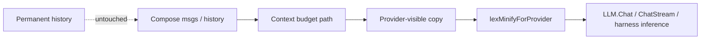

# Manifold Software Wiki

Manifold is a Go agent platform: orchestration, tools, memory, and multi-provider LLM calls. This wiki currently prioritizes the **lexminify** path — deterministic character/word-level minification of provider-visible messages.

## Start Here (lexminify)

| Page | Why |
| --- | --- |
| [lexminify package](components/lexminify.md) | Levels, zones (incl. tool default-on), protection, API |
| [Provider minify flow](flows/lexminify-provider-path.md) | Where hooks run; permanent history never mutated |
| [Architecture decisions](architecture/decisions.md) | Default level 6, system + tool zones on, rejected caps |
| [Evidence](evidence.md) | File/symbol provenance |
| [Testing notes](development/testing.md) | Focused `go test` packages |

## Repository Snapshot

| Area | Current Understanding | Evidence |
| --- | --- | --- |
| Primary language | Go modules under `manifold/` | `go.mod` |
| Agent core | `internal/agent` engine loop + harness | `engine.go`, `engine_loop.go`, `engine_harness.go` |
| Lexical minification | Pure Go package `internal/llm/lexminify` | `lexminify.go`, `protect.go`, `tables.go` |
| Default product level | `agent.DefaultLexMinifyLevel = 6` (`L5Aggressive`) | `engine.go` |
| Default zones | Runtime + history + **tool** + assistant + system prompt; **not** current-request body | `DefaultZones` in `lexminify.go` |
| Wire points | `lexMinifyForProvider` before `LLM.Chat` / stream / harness inference | `engine_lexminify.go`, `engine_loop.go`, `engine_harness.go` |

## Contributor Navigation

## Recent Working State (2026-07-14)

- Implementation complete and enabled by default at level **6**.
- `DefaultZones` includes `ZoneTool` and `ZoneSystemPrompt`.
- `[CURRENT REQUEST]` stays off by default zone bit; light cap when explicitly enabled.
- Tests: `go test -C manifold ./internal/llm/lexminify ./internal/agent`