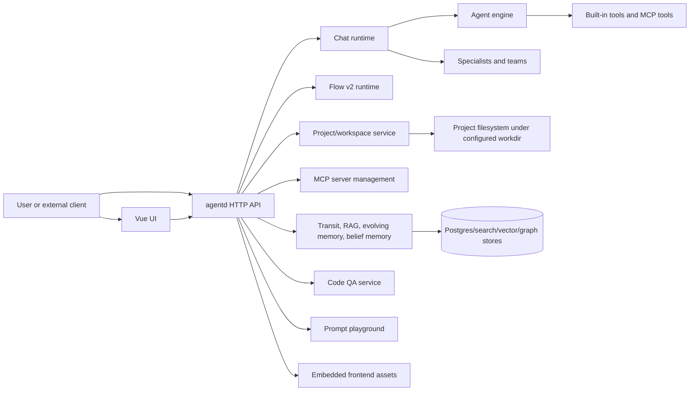

# Manifold Developer Wiki

Manifold is an experimental platform for long-horizon workflow automation with teams of AI assistants. This wiki is an onboarding map for contributors who need to understand the system deeply enough to run it, debug it, and change it safely.

## Fast Orientation

Start here if you are new:

1. [Repository Map](architecture/repository-map.md) - where code lives.
2. [Architecture Overview](architecture/overview.md) - system shape and dependency direction.
3. [Development Setup](development/setup.md) - local prerequisites and environment files.
4. [Build and Run](development/build-and-run.md) - Docker, host builds, frontend, and OpenAPI generation.
5. [Testing](development/testing.md) - Go, frontend, CI, and focused test guidance.
6. [HTTP API](interfaces/http-api.md) - backend route groups and generated OpenAPI.
7. [Change Risk Map](development/change-risk-map.md) - where to be extra careful.

## What Manifold Contains

Manifold is not a single-purpose chat app. It is a set of coordinated subsystems:

**Evidence:** `README.md`, `internal/agentd/app_init.go`, `internal/agentd/router.go`, `internal/agent/engine*.go`, `web/agentd-ui/src/router/index.ts`.

## Major Areas

### Architecture

- [Overview](architecture/overview.md)
- [Diagram Catalog](architecture/diagrams.md)
- [Architecture Decisions](architecture/decisions.md)
- [Repository Map](architecture/repository-map.md)

### Components

- [agentd Server](components/agentd.md)
- [Agent Engine](components/agent-engine.md)
- [Tools and MCP](components/tools-and-mcp.md)
- [LLM Providers](components/llm-providers.md)
- [Projects and Workspaces](components/projects-workspaces.md)
- [Flow v2](components/flow-v2.md)
- [Memory, RAG, Transit, and Beliefs](components/memory-rag-transit-beliefs.md)
- [Specialists and Teams](components/specialists-teams.md)
- [Matrix Gateway and Pulse](components/matrix-pulse.md)
- [Code QA](components/codeqa.md)
- [Playground](components/playground.md)
- [Frontend](components/frontend.md)
- [Persistence](components/persistence.md)
- [Auth and Observability](components/auth-observability.md)

### Runtime Flows

- [Chat Request](flows/chat-request.md)
- [Agent Tool Loop](flows/agent-tool-loop.md)
- [Flow v2 Run](flows/flow-v2-run.md)
- [Project File Operations](flows/project-file-ops.md)
- [MCP Lifecycle](flows/mcp-lifecycle.md)
- [Matrix and Pulse Runtime](flows/matrix-pulse-runtime.md)
- [Memory Ingest and Retrieval](flows/memory-ingest-retrieve.md)
- [Code QA Run](flows/codeqa-run.md)
- [Playground Experiment](flows/playground-experiment.md)

### Interfaces and Data

- [HTTP API](interfaces/http-api.md)
- [CLI and Make Targets](interfaces/cli.md)
- [Configuration](interfaces/configuration.md)
- [Tool Catalog](interfaces/tools.md)
- [Frontend Routes](interfaces/frontend-routes.md)
- [Storage Model](data/storage-model.md)
- [Postgres Schema](data/postgres-schema.md)
- [Memory Data Model](data/memory-systems.md)

### Development and Operations

- [Setup](development/setup.md)
- [Build and Run](development/build-and-run.md)
- [Testing](development/testing.md)
- [Contributor Playbook](development/contributing-playbook.md)
- [Change Risk Map](development/change-risk-map.md)
- [Deployment](operations/deployment.md)
- [Observability](operations/observability.md)
- [Security and Auth](operations/security-auth.md)
- [Backup and Recovery](operations/backup-recovery.md)

## One-Hour Onboarding Checklist

- [ ] Read `README.md`, `QUICKSTART.md`, and [Architecture Overview](architecture/overview.md).
- [ ] Identify the subsystem you will modify in [Repository Map](architecture/repository-map.md).
- [ ] Run or inspect the smallest relevant test from [Testing](development/testing.md).
- [ ] Check whether your change touches persistence, path safety, auth scoping, tool execution, streaming, or memory.
- [ ] Update this wiki if your change changes architecture, public interfaces, data schema, or developer workflow.

## Known Onboarding Warnings

- The project is explicitly experimental.
- The configured `workdir` is the root for user project files and tool sandboxing; path safety is a core invariant.
- The backend can run with external Postgres, embedded Postgres, or memory fallbacks depending on configuration.
- Some features are feature-gated in the UI.
- The checked-in CI workflow and `go.mod` Go versions should be checked before relying on CI behavior.

See [Evidence](evidence.md) for the crawl log and source inventory.
