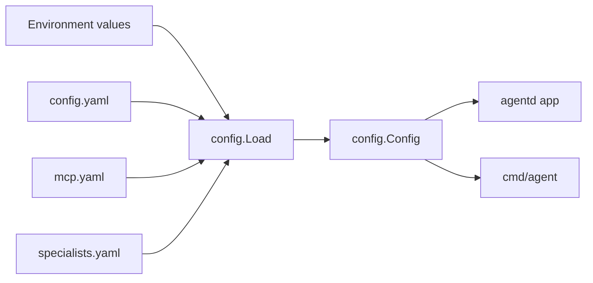

# Interface: Configuration

Manifold's primary runtime configuration is YAML plus environment interpolation.

## Config Files

| File | Purpose |
| --- | --- |
| `config.yaml` | Local runtime config used by `agentd` and CLI. |
| `config.yaml.example` | Full reference config. |
| `example.env` | Environment variable template. |
| `mcp.yaml` / `mcp.yaml.example` | Standalone MCP server definitions. |
| `specialists.yaml.example` | Example specialist definitions. |
| `docker-compose.yml` | Service-level environment, ports, volumes. |

## Config Areas

`internal/config/config.go` defines the top-level config. Important areas include:

- `workdir`
- system prompt and summary settings
- logging and payload logging
- execution limits
- `llm_client` and provider-specific config
- observability (`obs`)
- web/search settings
- Matrix gateway config
- auth config
- MCP config
- specialists and routes
- database/search/vector/graph/chat config
- tool enablement, allow lists, auto-discovery
- embeddings
- image tool
- evolving memory, Transit, belief memory
- TTS/STT
- run/workflow timeouts
- projects
- CodeQA
- tokenization

## Configuration Flow

## Developer Guidance

- Keep `config.yaml.example` in sync with `internal/config/config.go`.
- If adding config exposed in settings UI, update `internal/agentd/config_settings.go` and frontend settings types.
- Avoid changing defaults silently for safety-sensitive fields such as tools, command execution, auth, and path handling.
- Prefer environment interpolation for secrets.
- Be careful with `workdir`: it is the root for project workspaces and many tool contexts.

## Evidence

- `internal/config/config.go`, `loader.go`, and tests.
- `config.yaml.example`, `example.env`, `mcp.yaml.example`, `specialists.yaml.example`.
- `internal/agentd/config_settings.go` and `web/agentd-ui/src/api/client.ts` settings types.
