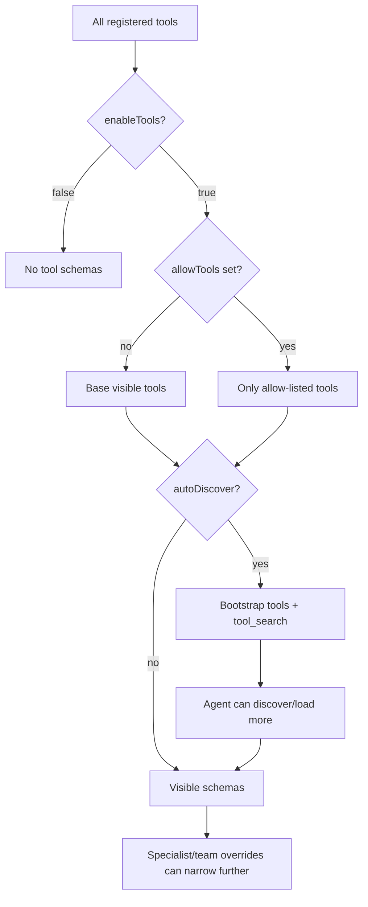

# Interface: Tool Catalog

This page summarizes the tool surface exposed by the backend. Actual availability depends on config, specialist/team settings, auto-discovery, Transit enablement, MCP config, and saved workflows.

## Built-In Tool Names

| Tool | Purpose |
| --- | --- |
| `run_cli` | Run allowed CLI commands inside configured workdir/project context. |
| `web_fetch` | Fetch a webpage and optionally index content. |
| `web_screenshot` | Capture web screenshots. |
| `apply_patch` | Apply unified diffs under allowed workspace. |
| `file_read` | Read files from current project workspace. |
| `file_write` | Create/update files in current project workspace. |
| `file_patch` | Replace a line range in a file. |
| `file_delete` | Delete files/directories with safeguards. |
| `split_text` | Split text for RAG/document workflows. |
| `utility_textbox` | Utility text box tool. |
| `agent_response` | Structured final response helper. |
| `matrix_room_message` | Send Matrix room messages. |
| `pulse_tasks` | List/create/update Pulse room tasks. |
| `llm_parallel_completions` | Run parallel LLM completions. |
| `multi_tool_use_parallel` | Dispatch independent tool calls in parallel. |
| `text_to_speech` | Generate speech audio. |
| `describe_image` | Describe images with a vision-capable provider. |
| `rag_ingest` | Ingest documents into RAG stores. |
| `rag_retrieve` | Retrieve from RAG stores. |
| `code_evolve` | AlphaEvolve-style code evolution. |
| `code_qa_judge` | LLM-assisted code quality judgment. |
| `code_qa_run` | Deterministic/quality gate run. |
| `code_qa_optimize` | Candidate edit generation/evaluation. |
| `transit_create` | Create Transit memory records. |
| `transit_get` | Get Transit records by key. |
| `transit_update` | Update Transit records. |
| `transit_delete` | Delete Transit records. |
| `transit_search` | Search Transit and return full records. |
| `transit_discover` | Search Transit and return metadata only. |
| `transit_list_keys` | List Transit keys. |
| `transit_list_recent` | List recent Transit keys. |
| `agent_call` | Invoke a specialist through internal delegator. |
| `ask_agent` | Call `/agent/run` style endpoint for a specialist. |
| `delegate_to_team` | Delegate to a team orchestrator. |
| `tool_search` | Discover/load tools when auto-discovery is enabled. |
| `warpp_*` | Saved Flow v2 workflow tools. |

## Tool Availability Diagram

## Evidence

- Tool names extracted from `internal/tools/**` `Name()` methods and constants.
- Registration sequence from `internal/agentd/app_init.go`.
- Discovery behavior from `internal/tools/discovery/*` and `internal/agentd/chat_engine_builders.go`.
