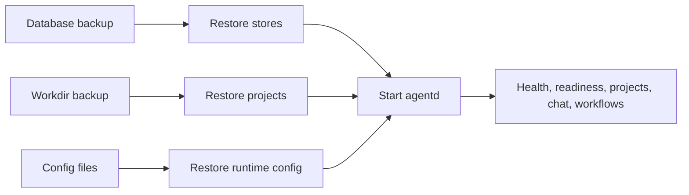

# Operations: Backup and Recovery

Manifold's recoverable state can span database state and project filesystem state.

## Back Up

- External Postgres or embedded Postgres data.
- The configured workdir, including all user project directories and `.meta` files.
- `config.yaml`, `mcp.yaml`, `specialists.yaml`, and deployment-specific env/config files, excluding secrets from insecure storage.
- Optional ClickHouse data if persistent observability history matters.

## Recovery Model

## Validation After Restore

- Health/readiness endpoints respond.
- Project list and file tree load.
- Chat sessions load if persisted.
- Specialists/MCP records load if persisted.
- Flow workflows and runs load if persisted.
- Transit and memory debug endpoints behave as expected when enabled.

## Evidence

- `docs/deployment.md` backup guidance.
- `internal/projects/service.go` project filesystem model.
- `internal/persistence/databases/factory.go` and store schemas.
- `docker-compose.yml` volumes.
