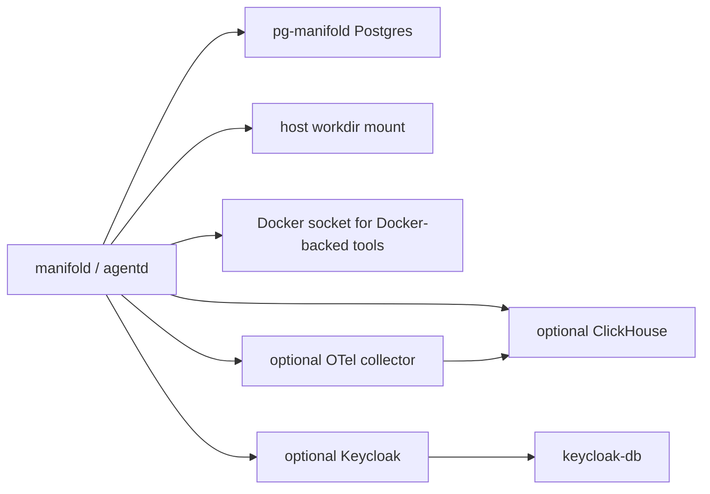

# Operations: Deployment

Manifold supports Docker Compose deployment and host development/self-contained runs.

## Compose Services

Core services:

- `manifold`: builds and runs `agentd` with embedded web UI.
- `pg-manifold`: Postgres with pgvector, PostGIS, and pgRouting extensions.

Optional services:

- `clickhouse` and `otel-collector` for persistent observability.
- `keycloak-db` and `keycloak` for local auth testing.

## Host Self-Contained Mode

Host mode can use embedded Postgres and local telemetry buffers. It is useful for single-machine development without Compose services. Configure embedded DB and leave external DB/telemetry DSNs empty.

## Ports

| Service | Purpose |
| --- | --- |
| Manifold UI/API | Web UI and backend API. |
| Postgres host port | Host access to compose Postgres. |
| Keycloak host port | Local auth provider UI/API when enabled. |
| ClickHouse HTTP/native ports | Persistent telemetry query backend when enabled. |
| OTLP collector ports | Metrics/traces/logs ingestion when enabled. |

See `docker-compose.yml` for exact port mappings.

## Evidence

- `docker-compose.yml`.
- `deploy/docker/cpu.Dockerfile` and `deploy/docker/postgres.Dockerfile`.
- `docs/deployment.md`, `QUICKSTART.md`, `README.md`.
- `internal/embeddedpg/*`.
