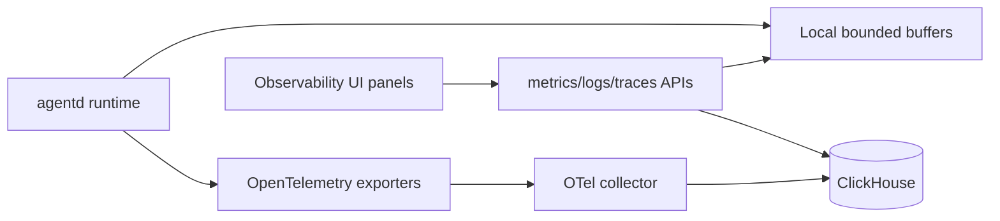

# Operations: Observability

Manifold has local process telemetry and optional persistent telemetry through OpenTelemetry and ClickHouse.

## Observability Flow

## What Is Observable

- Token totals.
- Memory metrics.
- Traces.
- Logs and log details.
- Run metrics.
- Process/local dashboard data.

## Contributor Guidance

- Use structured logs with context.
- Avoid logging secrets, raw credentials, and sensitive tool arguments.
- Respect `logPayloads` and `logRawPrompts` config; default behavior should be safe.
- If adding a long-running subsystem, add trace/log context and dashboard-visible metrics where appropriate.

## Evidence

- `internal/observability/*`.
- `internal/agentd/metrics_clickhouse.go`, `logs_clickhouse.go`, `traces_clickhouse.go`, `memory_metrics_clickhouse.go`, `process_metrics.go`.
- `deploy/configs/otel/collector.yaml`.
- `docs/observability.md`.
- `web/agentd-ui/src/components/observability/*` and `src/composables/observability/*`.
