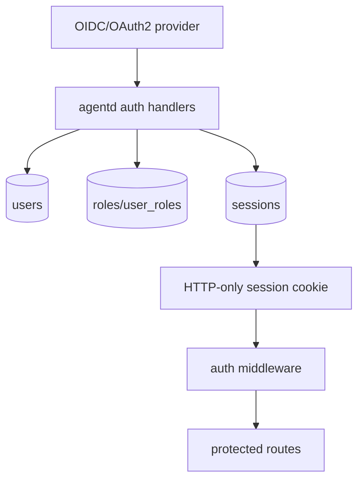

# Operations: Security and Auth

This page focuses on security-sensitive architecture, not production hardening guarantees.

## Security Boundaries

| Boundary | Why it matters |
| --- | --- |
| Project/workspace root | Constrains files, commands, MCP path-dependent servers, and agent actions. |
| Auth/session cookie | Separates users and admin routes when auth is enabled. |
| Tenant/user IDs | Scope chat, Transit, playground, specialists, projects, beliefs, and activities. |
| Tool allow lists | Limit model-visible capabilities. |
| MCP server config | External tools can expand capability and risk. |
| Logging redaction | Prevents secrets and prompts from leaking into logs. |
| Policy enforcement | Can block or annotate risky tool use when enabled. |

## Auth Model

## Contributor Guidance

- Do not weaken path validation to improve convenience.
- Never assume unauthenticated mode means no scoping; system user behavior still matters.
- Be cautious with admin-only user routes.
- Treat MCP server URLs/tokens and specialist API keys as secrets.
- Update tests when adding route-level auth requirements.

## Evidence

- `internal/auth/*`, `internal/agentd/handlers_auth.go`, `auth_init.go`.
- `internal/sandbox/*`, `internal/projects/service.go`, `internal/tools/filetool/tool.go`, `internal/tools/cli/exec.go`.
- `internal/policy/*`.
- `docs/auth.md`, `COMPLIANCE.md`.
